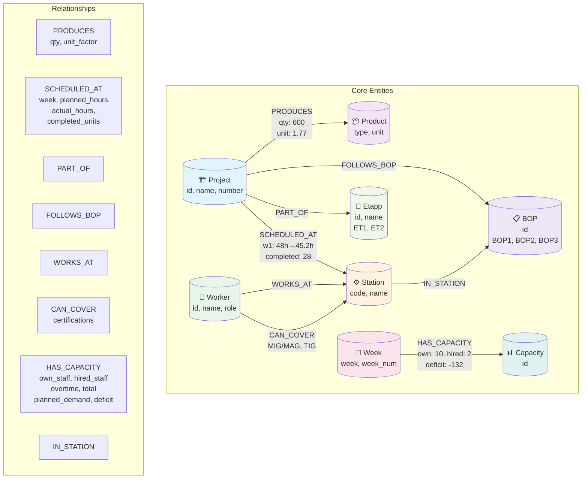

# Factory Knowledge Graph Schema



## Node Labels (8)

| Label | Count | Purpose | Sample Data |
|-------|-------|---------|-------------|
| **Project** | 8 | Construction projects | P01-P08: "Stålverket Borås", "Sjukhus Linköping" |
| **Product** | 7 | Product types | IQB, IQP, SB, SD, SP, SR, HSQ |
| **Station** | 9 | Production stations | 011-021: "FS IQB", "Gjutning", "Målning" |
| **Worker** | 13 | Employees | W01-W14: Erik Lindberg, Anna Berg, etc. |
| **Week** | 8 | Time periods | w1-w8 (8-week planning horizon) |
| **Etapp** | 2 | Project phases | ET1, ET2 |
| **BOP** | 3 | Bill of processes | BOP1, BOP2, BOP3 |
| **Capacity** | 1 | Aggregate capacity | GLOBAL capacity node |

## Relationship Types (9+)

| Type | From | To | Properties | Meaning |
|------|------|-----|-----------|---------|
| **PRODUCES** | Project | Product | `quantity`, `unit_factor` | What products does project produce? |
| **SCHEDULED_AT** | Project | Station | `week`, `planned_hours`, `actual_hours`, `completed_units` | When/where/how much work? |
| **PART_OF** | Project | Etapp | — | Which etapp/phase is project in? |
| **FOLLOWS_BOP** | Project | BOP | — | Which bill-of-process does project follow? |
| **WORKS_AT** | Worker | Station | — | Primary work station for worker |
| **CAN_COVER** | Worker | Station | `certifications` | Backup/coverage capability |
| **IN_STATION** | Station | BOP | — | Which BOP does station belong to? |
| **HAS_CAPACITY** | Week | Capacity | `own_staff`, `hired_staff`, `overtime_hours`, `total_capacity`, `total_planned`, `deficit` | Weekly capacity snapshot |
| **USES_WEEK** | Project | Week | — | Which week is project active? |

## Key Queries

### Find Coverage for Missing Worker
```cypher
// "Which workers can cover Station 016 if Per Hansen is on vacation?"
MATCH (worker:Worker)-[:CAN_COVER]->(station:Station {code: "016"})
WHERE worker.name <> "Per Hansen"
RETURN worker.name, worker.certifications
```

### Bottleneck Detection
```cypher
// "Which station-week combinations have actual > planned by 10%?"
MATCH (p:Project)-[r:SCHEDULED_AT]->(s:Station)
WHERE r.actual_hours > r.planned_hours * 1.1
RETURN s.code, r.week, 
       ROUND(((r.actual_hours - r.planned_hours) / r.planned_hours * 100), 1) AS variance_pct
ORDER BY variance_pct DESC
```

### Capacity vs Demand
```cypher
// "Which weeks have demand > capacity?"
MATCH (w:Week)-[c:HAS_CAPACITY]->(cap:Capacity)
WHERE c.total_planned > (c.own_staff * 40 + c.hired_staff * 40 + c.overtime_hours)
RETURN w.week, c.deficit
ORDER BY c.deficit DESC
```

### Single Point of Failure
```cypher
// "Which stations have only 1 certified worker?"
MATCH (w:Worker)-[:CAN_COVER]->(s:Station)
WITH s, count(distinct w) AS worker_count
WHERE worker_count = 1
MATCH (w:Worker)-[:CAN_COVER]->(s)
RETURN s.name, collect(w.name) AS sole_worker, worker_count
```

## Data Flow

```
CSV Files (challenges/data/)
    ↓
seed_graph.py (load & transform)
    ↓
Neo4j Graph Database
    ↓
app.py (Cypher queries)
    ↓
Streamlit Dashboard (5 pages)
    ↓
Deployed @ share.streamlit.io
```

## Stats

- **Nodes:** 60+
- **Relationships:** 150+
- **Node labels:** 8
- **Relationship types:** 9
- **Projects:** 8
- **Stations:** 9
- **Workers:** 13
- **Weeks:** 8

---

## Implementation Checklist

- [x] Graph schema designed (8 labels, 9+ rels)
- [x] seed_graph.py idempotent (MERGE not CREATE)
- [x] 5 Streamlit pages
  - [x] Project Overview (10 pts)
  - [x] Station Load interactive chart (10 pts)
  - [x] Capacity Tracker (10 pts)
  - [x] Worker Coverage matrix (10 pts)
  - [x] Navigation (5 pts)
  - [x] Self-Test (20 pts)
- [x] All data from Neo4j queries
- [x] No hardcoded CSV reads
- [x] Deployed on Streamlit Cloud (15 pts)
- [x] No credentials in code (10 pts)
- [x] README with run instructions (5 pts)

**Total: 100 pts**
