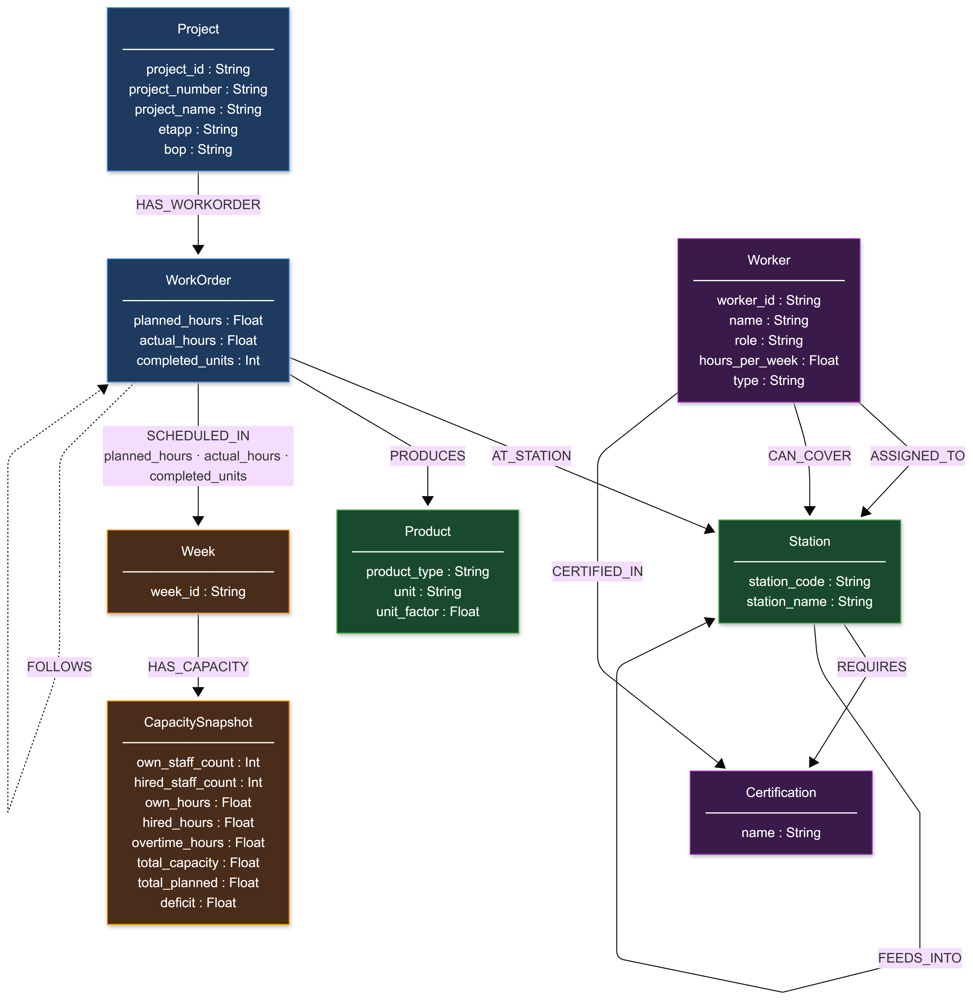
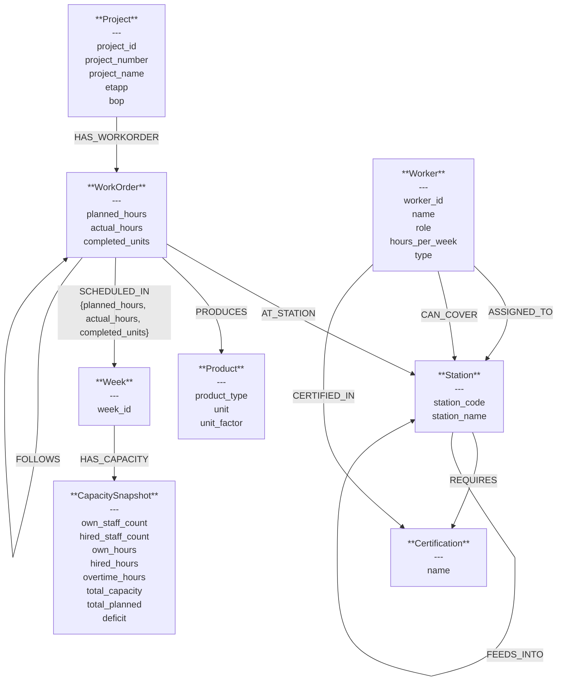

# Level 5 — Graph Schema
**Dia Vats**

---

## Schema Diagram

---

## Mermaid Source

---

## Relationship Properties

| Relationship | Properties |
|---|---|
| `(WorkOrder)-[:SCHEDULED_IN]->(Week)` | `planned_hours`, `actual_hours`, `completed_units` |
| `(Project)-[:PRODUCES]->(Product)` | `quantity`, `unit_factor` *(project-level aggregate)* |

---

## Node Summary (8 labels)

| # | Label | Key Properties | CSV Source |
|---|-------|---------------|-----------|
| 1 | `Project` | project_id, project_number, project_name, etapp, bop | factory_production.csv |
| 2 | `WorkOrder` | planned_hours, actual_hours, completed_units | factory_production.csv (one node per row) |
| 3 | `Station` | station_code, station_name | factory_production.csv |
| 4 | `Product` | product_type, unit, unit_factor | factory_production.csv |
| 5 | `Week` | week_id | both CSVs |
| 6 | `Worker` | worker_id, name, role, hours_per_week, type | factory_workers.csv |
| 7 | `Certification` | name | factory_workers.csv (split by comma) |
| 8 | `CapacitySnapshot` | own_staff_count, hired_staff_count, own_hours, hired_hours, overtime_hours, total_capacity, total_planned, deficit | factory_capacity.csv |

---

## Relationship Summary (11 types)

| # | Relationship | Direction | Properties |
|---|-------------|-----------|-----------|
| 1 | `HAS_WORKORDER` | Project → WorkOrder | — |
| 2 | `AT_STATION` | WorkOrder → Station | — |
| 3 | `PRODUCES` | WorkOrder → Product | — |
| 4 | `SCHEDULED_IN` | WorkOrder → Week | `planned_hours`, `actual_hours`, `completed_units` |
| 5 | `HAS_CAPACITY` | Week → CapacitySnapshot | — |
| 6 | `ASSIGNED_TO` | Worker → Station | — |
| 7 | `CAN_COVER` | Worker → Station | — |
| 8 | `CERTIFIED_IN` | Worker → Certification | — |
| 9 | `REQUIRES` | Station → Certification | — |
| 10 | `FEEDS_INTO` | Station → Station | — |
| 11 | `FOLLOWS` | WorkOrder → WorkOrder | — |

---

## Design Notes

`FEEDS_INTO` between stations captures the physical production flow (e.g. 011 FS IQB → 012 Förmontering → 013 Montering). This isn't in any CSV directly — it's derived from the station sequence implicit in the data. It lets you query downstream impact from a bottleneck station.

`FOLLOWS` between WorkOrders links the same project-station pair across consecutive weeks, making temporal progression traversable without aggregating by week in every query.