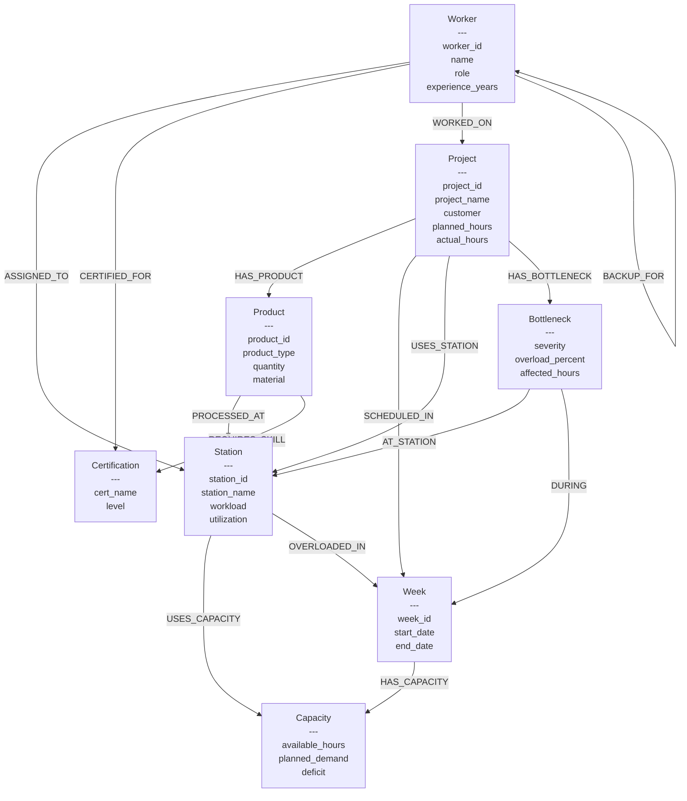

# Factory Production Knowledge Graph Schema

```mermaid
graph TD

    Project -->|HAS_PRODUCT| Product
    Product -->|PROCESSED_AT| Station
    Worker -->|ASSIGNED_TO| Station
    Worker -->|CERTIFIED_FOR| Certification
    Worker -->|WORKED_ON| Project
    Project -->|SCHEDULED_IN| Week
    Week -->|HAS_CAPACITY| Capacity
    Station -->|USES_CAPACITY| Capacity
    Project -->|USES_STATION| Station
    Station -->|OVERLOADED_IN| Week
    Project -->|HAS_BOTTLENECK| Bottleneck
    Bottleneck -->|AT_STATION| Station
    Bottleneck -->|DURING| Week
    Worker -->|BACKUP_FOR| Worker
    Product -->|REQUIRES_SKILL| Certification

    Project[
        Project
        ---
        project_id
        project_name
        customer
        planned_hours
        actual_hours
    ]

    Product[
        Product
        ---
        product_id
        product_type
        quantity
        material
    ]

    Station[
        Station
        ---
        station_id
        station_name
        workload
        utilization
    ]

    Worker[
        Worker
        ---
        worker_id
        name
        role
        experience_years
    ]

    Certification[
        Certification
        ---
        cert_name
        level
    ]

    Week[
        Week
        ---
        week_id
        start_date
        end_date
    ]

    Capacity[
        Capacity
        ---
        available_hours
        planned_demand
        deficit
    ]

    Bottleneck[
        Bottleneck
        ---
        severity
        overload_percent
        affected_hours
    ]
```