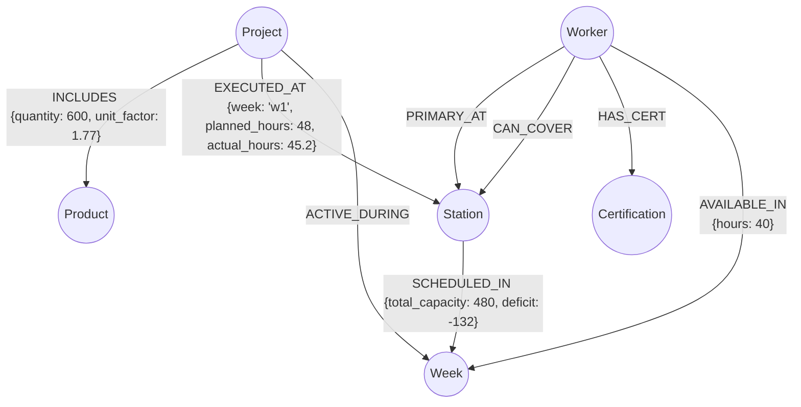

# Level 5 - Graph Thinking
**Submitted by Priyanshu Bhardwaj**

---

## Q1. Model It (20 pts)

See `schema.md` for the full diagram. 

### Summary

**6 Node Labels:** `Project`, `Product`, `Station`, `Worker`, `Week`, `Certification`

**8 Relationship Types:**

| Relationship | Direction | Properties |
|---|---|---|
| `INCLUDES` | Project → Product | **`quantity`, `unit_factor`** |
| `EXECUTED_AT` | Project → Station | **`week`, `planned_hours`, `actual_hours`** |
| `PRIMARY_AT` | Worker → Station | — |
| `CAN_COVER` | Worker → Station | — |
| `HAS_CERT` | Worker → Certification | — |
| `SCHEDULED_IN` | Station → Week | **`total_capacity`, `deficit`** |
| `ACTIVE_DURING` | Project → Week | — |
| `AVAILABLE_IN` | Worker → Week | **`hours`** |

**Design decision:** `EXECUTED_AT`, `INCLUDES`, and `SCHEDULED_IN` carry properties because they represent volatile, measurable states (planned vs. actual hours, capacity deficits, and volume requirements) that dictate the factory's operational load.



---

## Q2. Why Not Just SQL? (20 pts)

**Query:** *"Which workers are certified to cover Station 016 (Gjutning) when Per Hansen is on vacation, and which projects would be affected?"*

### SQL Version

```sql
SELECT 
    w.name AS Covering_Worker,
    p.project_name AS Affected_Project
FROM factory_workers w
JOIN factory_production p ON p.station_code = '016'
WHERE w.can_cover_stations LIKE '%016%'
  AND w.name != 'Per Hansen';
```

### Cypher Version

```cypher
MATCH (absent:Worker {name: "Per Hansen"})-[:PRIMARY_AT]->(s:Station {station_code: "016"})
MATCH (cover:Worker)-[:CAN_COVER]->(s)
WHERE cover <> absent
MATCH (p:Project)-[exec:EXECUTED_AT]->(s)
RETURN cover.name AS Covering_Worker, p.project_name AS Affected_Project
```

### What Graph Makes Obvious
SQL hides the many-to-many relationship of worker coverage behind a clunky comma-separated string (`can_cover_stations`) that requires slow `LIKE` string-matching or complex junction tables. In the graph, the `CAN_COVER` relationship is an explicit, first-class entity; traversing from the absent worker to the station, to the replacement worker, and out to the affected projects is structurally intuitive and highlights single-point-of-failure vulnerabilities instantly.

---

## Q3. Spot the Bottleneck (20 pts)

### 1. Cypher Query — Overruns >10% Grouped by Station

```cypher
MATCH (p:Project)-[exec:EXECUTED_AT]->(s:Station)
WHERE exec.actual_hours > (exec.planned_hours * 1.10)
RETURN 
    p.project_name, 
    s.station_name, 
    exec.week, 
    exec.planned_hours, 
    exec.actual_hours
ORDER BY (exec.actual_hours - exec.planned_hours) DESC
```

### 2. Modelling the Alert as a Graph Pattern

Instead of burying a bottleneck as an isolated property calculation, it should be modelled as an explicit event node: `(:BottleneckAlert)`. 

```cypher
// Graph Pattern for Alert Modeling
(p:Project)-[:TRIGGERED]->(b:BottleneckAlert)-[:OCCURRED_AT]->(s:Station)
```

This allows for automated nightly graph jobs that generate alert nodes when actual hours severely exceed planned hours. By querying these nodes, you can quickly analyze historical trends, asking questions like *"Which stations accumulate the most Bottleneck Alerts?"* or linking them to `(:Week)` nodes to visualize the factory's peak stress periods.

---

## Q4. Vector + Graph Hybrid (20 pts)

### 1. What to Embed
Embed the **Project descriptions and requirements** (the contextual summary, complexity parameters, and client expectations) into the `Project` node as a dense vector. Example: *"450 meters of IQB beams for a hospital extension in Linköping, tight timeline."*

### 2. Hybrid Query — Vector Similarity + Graph Filter

```cypher
// 1. Vector Search: Find structurally/thematically similar past projects
CALL db.index.vector.queryNodes('project_embeddings', 5, $new_project_vector) 
YIELD node AS pastProject, score

// 2. Graph Filter: Traverse to find which of those similar projects succeeded operationally
MATCH (pastProject)-[exec:EXECUTED_AT]->(s:Station)
WITH pastProject, score, sum(exec.actual_hours) AS total_actual, sum(exec.planned_hours) AS total_planned
WHERE (total_actual - total_planned) / total_planned < 0.05

RETURN 
    pastProject.project_name, 
    score, 
    total_planned, 
    total_actual
ORDER BY score DESC
```

### 3. Why This Beats Plain Filtering
Filtering solely by "IQB beams" treats a simple warehouse beam exactly the same as a highly complex, tight-tolerance beam for a hospital. Vector embeddings understand semantic intent and context. By combining this with the graph, you retrieve projects that were not just semantically similar, but mathematically proven to have been executed well (variance < 5%), providing highly reliable baseline data for quoting new jobs.

---

## Q5. My L6 Blueprint (20 pts)

### Node Labels → CSV Column Mappings

| Node | CSV | Mapped Columns |
|------|-----|----------------|
| `(:Project)` | factory_production.csv | `project_id`, `project_number`, `project_name` |
| `(:Station)` | factory_production.csv | `station_code`, `station_name` |
| `(:Worker)` | factory_workers.csv | `worker_id`, `name`, `role`, `type` |
| `(:Week)` | factory_capacity.csv | `week` |

### Relationship Types and What Creates Them

| Relationship | Created By |
|---|---|
| `(Project)-[:EXECUTED_AT]->(Station)` | Grouping rows in `factory_production.csv`, storing `week`, `planned_hours`, `actual_hours` |
| `(Worker)-[:CAN_COVER]->(Station)` | Splitting the `can_cover_stations` string in `factory_workers.csv` |
| `(Station)-[:SCHEDULED_IN]->(Week)` | Mapping `factory_capacity.csv` data to track `total_capacity` and `deficit` |

### 4 Streamlit Dashboard Panels

#### Panel 1 — Project Overview
Shows all projects with total planned hours, actual hours, and variance percentage.
```cypher
MATCH (p:Project)
OPTIONAL MATCH (p)-[exec:EXECUTED_AT]->()
WITH p, sum(exec.planned_hours) AS planned, sum(exec.actual_hours) AS actual
RETURN 
    p.project_number, 
    p.project_name,
    planned AS total_planned, 
    actual AS total_actual,
    CASE WHEN planned > 0 THEN round(((actual - planned) / planned) * 100, 1) ELSE 0 END AS variance_pct
ORDER BY p.project_number
```

#### Panel 2 — Station Load Across Weeks
Visualizes hours per station across weeks to highlight where actual exceeds planned.
```cypher
MATCH (p:Project)-[exec:EXECUTED_AT]->(s:Station)
RETURN 
    s.station_name, 
    exec.week AS week,
    sum(exec.planned_hours) AS planned_load,
    sum(exec.actual_hours) AS actual_load
ORDER BY week, s.station_name
```

#### Panel 3 — Capacity Tracker
Shows weekly capacity vs demand, flagging deficit weeks.
```cypher
MATCH (s:Station)-[sched:SCHEDULED_IN]->(w:Week)
RETURN 
    w.id AS Week, 
    sum(sched.total_capacity) AS Capacity, 
    sum(sched.deficit) AS Deficit
ORDER BY Week
```

#### Panel 4 — Worker Coverage Matrix
Displays which workers cover which stations and highlights Single Points of Failure (SPOF).
```cypher
MATCH (w:Worker)-[:CAN_COVER]->(s:Station)
WITH s, count(w) AS cover_count, collect(w.name) AS covered_by
RETURN 
    s.station_name, 
    cover_count, 
    covered_by,
    CASE WHEN cover_count = 1 THEN true ELSE false END AS is_spof
ORDER BY cover_count ASC
```
