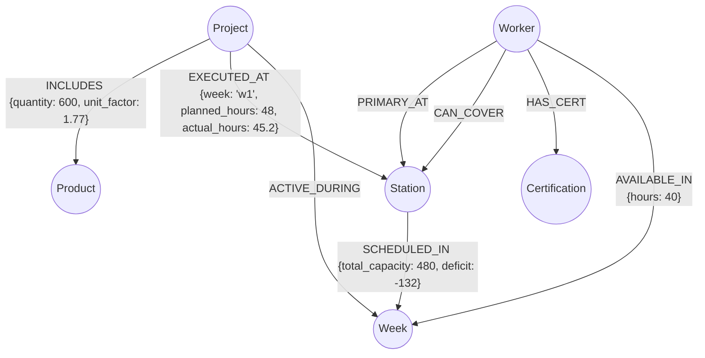

```mermaid
graph TD
    Project((Project)) -->|"INCLUDES <br>{quantity: 600, unit_factor: 1.77}"| Product((Product))
    Project -->|"EXECUTED_AT <br>{week: 'w1', planned_hours: 48, actual_hours: 45.2}"| Station((Station))
    Worker((Worker)) -->|"PRIMARY_AT"| Station
    Worker -->|"CAN_COVER"| Station
    Worker -->|"HAS_CERT"| Certification((Certification))
    Station -->|"SCHEDULED_IN <br>{total_capacity: 480, deficit: -132}"| Week((Week))
    Project -->|"ACTIVE_DURING"| Week
    Worker -->|"AVAILABLE_IN <br>{hours: 40}"| Week
```
