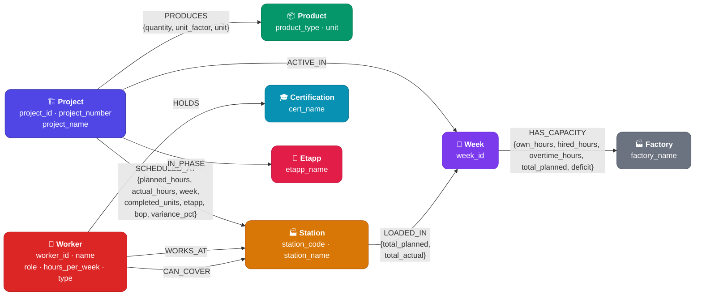

# Factory Knowledge Graph — Schema

## Node Labels (8)

| # | Label | Source CSV | Key Properties | Count |
|---|-------|-----------|----------------|-------|
| 1 | **Project** | production.csv | project_id, project_number, project_name | 8 |
| 2 | **Product** | production.csv | product_type, unit | 7 (IQB, IQP, SB, SD, SP, SR, HSQ) |
| 3 | **Station** | production.csv | station_code, station_name | 10 (011–019, 021) |
| 4 | **Worker** | workers.csv | worker_id, name, role, hours_per_week, type | 14 |
| 5 | **Week** | capacity.csv | week_id | 8 (w1–w8) |
| 6 | **Factory** | Implicit | factory_name | 1 |
| 7 | **Certification** | workers.csv | cert_name | 23 unique certs |
| 8 | **Etapp** | production.csv | etapp_name | 2 (ET1, ET2) |

## Relationship Types (9)

| # | Relationship | From → To | Properties (data-carrying?) |
|---|-------------|-----------|----------------------------|
| 1 | **PRODUCES** | Project → Product | ✅ `{quantity, unit_factor, unit}` |
| 2 | **SCHEDULED_AT** | Project → Station | ✅ `{planned_hours, actual_hours, completed_units, week, etapp, bop, variance_pct}` |
| 3 | **ACTIVE_IN** | Project → Week | — |
| 4 | **IN_PHASE** | Project → Etapp | — |
| 5 | **WORKS_AT** | Worker → Station | — (primary station) |
| 6 | **CAN_COVER** | Worker → Station | — (coverage capability) |
| 7 | **HOLDS** | Worker → Certification | — |
| 8 | **LOADED_IN** | Station → Week | ✅ `{total_planned, total_actual}`* |
| 9 | **HAS_CAPACITY**| Week → Factory | ✅ `{own_hours, hired_hours, overtime_hours, total_planned, deficit}` |

> 4 relationships carry data properties (**PRODUCES**, **SCHEDULED_AT**, **LOADED_IN**, **HAS_CAPACITY**), exceeding the minimum of 2.
>
> *\*Note: `LOADED_IN` properties are calculated by aggregating the `SCHEDULED_AT` edges for each station/week.*
>
> *\*Note: `etapp` is also kept as a property on `SCHEDULED_AT` for direct querying. The `Etapp` node is included for L6 compliance, but from a pure design perspective, etapp works better as an edge property since it only has 2 values and carries no properties of its own.*
