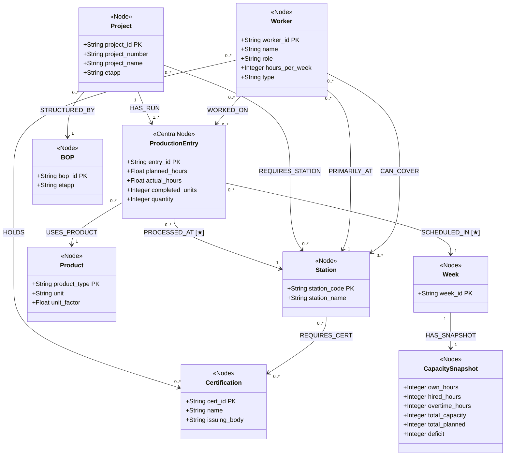

# Factory Knowledge Graph — Neo4j Schema

> Swedish steel fabrication factory · 8 projects · 9 production stations · 13 workers  
> Stack: Neo4j 5.x · Python driver · Streamlit · (optional) vector index for hybrid search

> **[★] Relationship properties** stored as Neo4j edge attributes:
>
> | Relationship | Properties |
> |---|---|
> | `PROCESSED_AT` | `planned_hours: Float`, `actual_hours: Float`, `completed_units: Integer` |
> | `SCHEDULED_IN` | `planned_hours: Float`, `actual_hours: Float` |

---

## Node Reference

| Label | Stereotype | Key Properties | CSV Source |
|---|---|---|---|
| `Project` | `<<Node>>` | project_id (PK), project_number, project_name, etapp | factory_production.csv |
| `ProductionEntry` | `<<CentralNode>>` | entry_id (PK), planned_hours, actual_hours, completed_units, quantity | factory_production.csv |
| `Station` | `<<Node>>` | station_code (PK), station_name | factory_production.csv |
| `Product` | `<<Node>>` | product_type (PK), unit, unit_factor | factory_production.csv |
| `Worker` | `<<Node>>` | worker_id (PK), name, role, hours_per_week, type | factory_workers.csv |
| `Week` | `<<Node>>` | week_id (PK) | factory_capacity.csv |
| `CapacitySnapshot` | `<<Node>>` | own_hours, hired_hours, overtime_hours, total_capacity, total_planned, deficit | factory_capacity.csv |
| `Certification` | `<<Node>>` | cert_id (PK), name, issuing_body | factory_workers.csv |
| `BOP` | `<<Node>>` | bop_id (PK), etapp | factory_production.csv |

## Relationship Reference

| Relationship | From → To | Cardinality | Properties |
|---|---|---|---|
| `HAS_RUN` | Project → ProductionEntry | `1 → 1..*` | — |
| `USES_PRODUCT` | ProductionEntry → Product | `0..* → 1` | — |
| `PROCESSED_AT` ★ | ProductionEntry → Station | `0..* → 1` | planned_hours, actual_hours, completed_units |
| `SCHEDULED_IN` ★ | ProductionEntry → Week | `0..* → 1` | planned_hours, actual_hours |
| `REQUIRES_STATION` | Project → Station | `0..* → 0..*` | — |
| `STRUCTURED_BY` | Project → BOP | `0..* → 1` | — |
| `PRIMARILY_AT` | Worker → Station | `0..* → 1` | — |
| `CAN_COVER` | Worker → Station | `0..* → 0..*` | — |
| `WORKED_ON` | Worker → ProductionEntry | `0..* → 0..*` | — |
| `HOLDS` | Worker → Certification | `0..* → 0..*` | — |
| `REQUIRES_CERT` | Station → Certification | `0..* → 0..*` | — |
| `HAS_SNAPSHOT` | Week → CapacitySnapshot | `1 → 1` | — |
