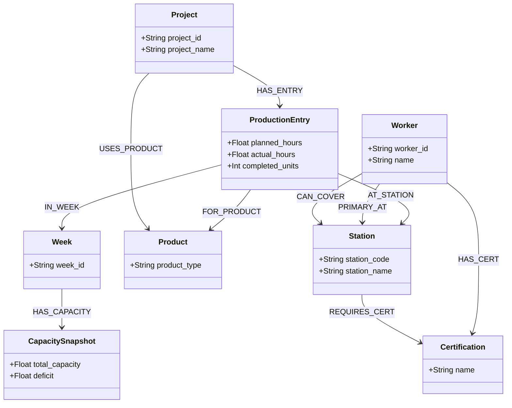

# Level 5 — Graph Schema

```mermaid
classDiagram
    direction TB

    class Project {
        +String project_id
        +String project_name
    }

    class ProductionEntry {
        +Float planned_hours
        +Float actual_hours
        +Int completed_units
    }

    class Station {
        +String station_code
        +String station_name
    }

    class Product {
        +String product_type
    }

    class Week {
        +String week_id
    }

    class Worker {
        +String worker_id
        +String name
    }

    class Certification {
        +String name
    }

    class CapacitySnapshot {
        +Float total_capacity
        +Float deficit
    }

    Project --> ProductionEntry : HAS_ENTRY
    ProductionEntry --> Station : AT_STATION
    ProductionEntry --> Product : FOR_PRODUCT
    ProductionEntry --> Week : IN_WEEK
    Week --> CapacitySnapshot : HAS_CAPACITY
    Worker --> Station : PRIMARY_AT
    Worker --> Station : CAN_COVER
    Worker --> Certification : HAS_CERT
    Station --> Certification : REQUIRES_CERT
    Project --> Product : USES_PRODUCT
```