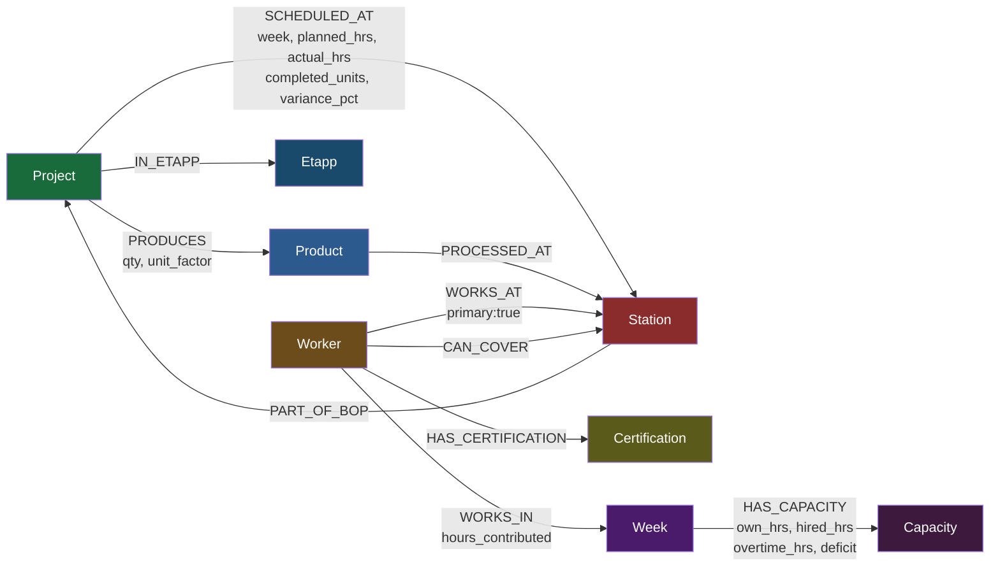

# Level 5 — Graph Thinking
## Ankit Kumar Singh — ankitsinghh007

---

## Q1. Model It — Graph Schema

### Node Labels (8 total)

| Label | Key Properties | Source |
|-------|---------------|--------|
| `Project` | id, number, name, etapp, bop | factory_production.csv |
| `Product` | type, unit, unit_factor | factory_production.csv |
| `Station` | code, name | factory_production.csv |
| `Worker` | id, name, role, hours_per_week, type | factory_workers.csv |
| `Week` | id (w1–w8) | factory_capacity.csv |
| `Etapp` | id (ET1/ET2) | factory_production.csv |
| `Certification` | name | factory_workers.csv |
| `Capacity` | week, own_hours, hired_hours, overtime_hours, total_capacity, total_planned, deficit | factory_capacity.csv |

### Relationship Types (10 total, 2 with data properties)

```
(Project)-[:PRODUCES {quantity, unit_factor}]->(Product)
(Project)-[:SCHEDULED_AT {week, planned_hours, actual_hours, completed_units, variance_pct}]->(Station)  ← carries data
(Worker)-[:WORKS_AT {primary: true}]->(Station)
(Worker)-[:CAN_COVER]->(Station)
(Worker)-[:HAS_CERTIFICATION]->(Certification)
(Week)-[:HAS_CAPACITY {own_hours, hired_hours, overtime_hours, total_capacity, total_planned, deficit}]->(Capacity)  ← carries data
(Project)-[:IN_ETAPP]->(Etapp)
(Product)-[:PROCESSED_AT]->(Station)
(Worker)-[:WORKS_IN {hours_contributed}]->(Week)
(Station)-[:PART_OF_BOP {bop_id}]->(Project)
```

### Schema Diagram (Mermaid)



### Two Relationships Carrying Data

**1. `SCHEDULED_AT` — the core operational relationship**
```
(P03:Project {id:"P03"})-[:SCHEDULED_AT {
    week: "w2",
    planned_hours: 28.0,
    actual_hours: 35.0,
    completed_units: 8,
    variance_pct: 25.0    ← 25% over: this is a bottleneck
}]->(S016:Station {code:"016", name:"Gjutning"})
```

**2. `HAS_CAPACITY` — weekly workforce capacity**
```
(w1:Week {id:"w1"})-[:HAS_CAPACITY {
    own_hours: 400,
    hired_hours: 80,
    overtime_hours: 0,
    total_capacity: 480,
    total_planned: 612,
    deficit: -132         ← worst deficit in the dataset
}]->(cap1:Capacity)
```

---

## Q2. Why Not Just SQL?

### The Query
*"Which workers are certified to cover Station 016 (Gjutning) when Per Hansen is on vacation, and which projects would be affected?"*

### SQL Version

```sql
-- Step 1: Who can cover station 016 (excluding Per Hansen)?
SELECT
    w.worker_id,
    w.name,
    w.role,
    w.certifications
FROM workers w
WHERE w.worker_id != 'W07'  -- Per Hansen
  AND (
      w.primary_station = '016'
      OR '016' = ANY(string_to_array(w.can_cover_stations, ','))
  );

-- Step 2: Which projects are currently at station 016?
SELECT DISTINCT
    p.project_id,
    p.project_name,
    fp.week,
    fp.planned_hours,
    fp.actual_hours
FROM factory_production fp
JOIN projects p ON fp.project_id = p.project_id
WHERE fp.station_code = '016';

-- To answer BOTH questions together: a JOIN across 3 tables
SELECT
    w.name AS backup_worker,
    w.certifications,
    p.project_name AS affected_project,
    fp.week,
    fp.planned_hours
FROM workers w
CROSS JOIN factory_production fp
JOIN projects p ON fp.project_id = p.project_id
WHERE fp.station_code = '016'
  AND w.worker_id != 'W07'
  AND (
      w.primary_station = '016'
      OR '016' = ANY(string_to_array(w.can_cover_stations, ','))
  );
```

### Cypher Version

```cypher
MATCH (s:Station {code: "016"})<-[:CAN_COVER]-(backup:Worker)
WHERE backup.name <> "Per Hansen"
WITH s, collect(backup) AS backups
MATCH (p:Project)-[r:SCHEDULED_AT]->(s)
RETURN
    s.name AS station,
    [b IN backups | b.name] AS available_backups,
    collect(DISTINCT p.name) AS affected_projects,
    collect(DISTINCT r.week) AS affected_weeks
```

### What the Graph Makes Obvious

The SQL version requires the reader to mentally reconstruct the coverage network from three separate tables — workers, a serialised `can_cover_stations` string, and production rows — and join them together. The Cypher query reads the actual shape of the problem: a worker *covers* a station, and projects are *scheduled at* that station. In a graph you traverse the network directly; there is no JOIN, no string splitting, and no CROSS JOIN to link the two halves of the question. Critically, the graph also reveals single-point-of-failure stations instantly — if only one `CAN_COVER` edge points to a station node, that is visible in one hop, whereas SQL requires an aggregation with a HAVING count = 1 subquery.

---

## Q3. Spot the Bottleneck

### 1. Which projects/stations are causing the overload

Using actual data from `factory_capacity.csv` and `factory_production.csv`:

**Deficit weeks:**
- w1: deficit **−132 hrs** (worst) — capacity 480, planned 612
- w2: deficit **−125 hrs** — capacity 520, planned 645
- w4: deficit **−50 hrs** — capacity 500, planned 550
- w6: deficit **−80 hrs** — capacity 440, planned 520
- w7: deficit **−80 hrs** — capacity 520, planned 600

**Projects/stations causing w1 overload (planned hours > 40, actual > planned):**

| Project | Station | Week | Planned | Actual | Variance |
|---------|---------|------|---------|--------|----------|
| P03 Lagerhall Jönköping | 014 Svets o montage | w1 | 42.0 | 48.0 | **+14.3%** |
| P05 Sjukhus Linköping | 011 FS IQB | w1 | 95.0 | 90.0 | -5.3% |
| P05 Sjukhus Linköping | 014 Svets o montage | w1 | 58.0 | 62.0 | **+6.9%** |
| P08 Bro E6 Halmstad | 014 Svets o montage | w1 | 40.0 | 44.0 | **+10.0%** |

**Root cause:** Station 014 (Svets o montage IQB) is being hit by P03, P05, and P08 simultaneously in w1. P03's Gjutning (016) is 25% over in w2. These two stations — 014 and 016 — are the primary bottlenecks.

### 2. Cypher Query — Actual > Planned by more than 10%, grouped by station

```cypher
MATCH (p:Project)-[r:SCHEDULED_AT]->(s:Station)
WHERE r.actual_hours > r.planned_hours * 1.1
WITH s,
     collect({
         project: p.name,
         week: r.week,
         planned: r.planned_hours,
         actual: r.actual_hours,
         variance_pct: round(100.0 * (r.actual_hours - r.planned_hours) / r.planned_hours * 10) / 10
     }) AS overruns,
     sum(r.actual_hours - r.planned_hours) AS total_excess_hours
RETURN
    s.code AS station_code,
    s.name AS station_name,
    size(overruns) AS overrun_count,
    total_excess_hours,
    overruns
ORDER BY total_excess_hours DESC
```

**Expected results from our data:**
- Station 016 (Gjutning): P03 w2 +25%, P05 w2 +14.3%, P07 w2 +10%, P08 w3 +13.6%
- Station 014 (Svets o montage): P03 w1 +14.3%, P04 w1 +12%, P05 w1 +6.9%, P08 w1 +10%
- Station 021 (SR B/F-hall): P04 w2 +8.3%

### 3. Modelling the Alert as a Graph Pattern

I would use a **`(:Bottleneck)` node** with a `TRIGGERED_BY` relationship rather than a property on the existing relationship. Here's why: bottlenecks are emergent — they arise from the *combination* of multiple projects overloading one station, not from any single relationship. A property on `SCHEDULED_AT` captures per-row variance, but cannot represent the aggregated station-level alert.

```cypher
// Create Bottleneck node when a station has 2+ overruns in one week
MATCH (p:Project)-[r:SCHEDULED_AT]->(s:Station)
WHERE r.actual_hours > r.planned_hours * 1.1
WITH s, r.week AS week, count(p) AS overrun_count, sum(r.actual_hours - r.planned_hours) AS excess
WHERE overrun_count >= 2
MERGE (b:Bottleneck {station_code: s.code, week: week})
SET b.excess_hours = excess,
    b.severity = CASE WHEN excess > 20 THEN "HIGH"
                      WHEN excess > 10 THEN "MEDIUM"
                      ELSE "LOW" END
MERGE (b)-[:TRIGGERED_AT]->(s)
```

This lets you query: `MATCH (b:Bottleneck {severity:"HIGH"}) RETURN b` — and immediately see which stations and weeks are in crisis, with the contributing projects one hop away.

---

## Q4. Vector + Graph Hybrid

### 1. What to Embed

I would embed **project descriptions** constructed from multiple fields — not just the project name. Specifically I would embed a text string like:

```
"Sjukhus Linköping ET2: IQB 1200m hospital construction,
 stations 011 012 013 014 015 016 017 018 021,
 high complexity, etapp ET2, total planned 538h,
 products: IQB IQP SB SD SR, 8-week schedule"
```

This captures project scope, product mix, station footprint, and complexity in one vector. I would also embed **worker skill profiles** (`"Hydraulics Mechanics Crane MIG/MAG ISO 9606"`) to enable worker-to-project matching.

I would NOT embed raw CSV rows or individual planned_hours values — those are structured data that belongs in the graph, not vector space.

### 2. Hybrid Query

*"Find similar past projects [vector] that used the same stations and had variance < 5% [graph]"*

```cypher
// Step 1: Vector similarity search (via db.index.vector or custom integration)
// Returns candidate project IDs ranked by embedding distance

// Step 2: Graph filter on candidates
WITH ["P01","P03","P05"] AS similar_project_ids  // from vector search
MATCH (new_project:Project {id: "P05"})
MATCH (new_project)-[:SCHEDULED_AT]->(shared_station:Station)
MATCH (candidate:Project)-[r:SCHEDULED_AT]->(shared_station)
WHERE candidate.id IN similar_project_ids
  AND candidate.id <> new_project.id
WITH candidate,
     count(DISTINCT shared_station) AS shared_stations,
     avg(abs(r.actual_hours - r.planned_hours) / r.planned_hours) AS avg_variance
WHERE avg_variance < 0.05
RETURN
    candidate.name AS similar_project,
    shared_stations,
    round(avg_variance * 100, 1) AS variance_pct
ORDER BY shared_stations DESC, avg_variance ASC
LIMIT 5
```

### 3. Why This Is More Useful Than Filtering by Product Type

Filtering by product type (`IQB`, `IQP`, `SB`) finds projects that made the same things — but a hospital project and a parking structure both use IQB beams. The hybrid approach finds projects that were *operationally similar*: same stations (same production flow), similar complexity, AND historically low variance. That last condition is the key — it surfaces past projects whose actual execution matched their plan, which are the only useful analogues for estimating future schedules. A product-type filter has no way to surface execution quality from historical data.

**Boardy parallel:** Instead of matching by project scope, Boardy matches people whose embedded `needs` description is close in vector space to another person's `offers` description, AND who are in the same community in the relationship graph (KNOWS, ATTENDS, WORKS_AT edges). The vector surface plausible matches; the graph confirms they're socially reachable. Neither alone would work as well.

---

## Q5. Level 6 Blueprint

### Node Labels and CSV Column Mapping

| Node Label | CSV Source | Key Properties |
|------------|-----------|----------------|
| `Project` | factory_production.csv | `id` (P01–P08), `number` (4501–4508), `name`, `etapp`, `bop` |
| `Product` | factory_production.csv | `type` (IQB/IQP/SB/SD/SP/SR/HSQ), `unit`, `unit_factor` |
| `Station` | factory_production.csv | `code` (011–021), `name` |
| `Worker` | factory_workers.csv | `id` (W01–W14), `name`, `role`, `hours_per_week`, `type` (permanent/hired) |
| `Week` | factory_capacity.csv | `id` (w1–w8) |
| `Etapp` | factory_production.csv | `id` (ET1/ET2) |
| `Certification` | factory_workers.csv | `name` (MIG/MAG, TIG, ISO 9606, etc.) |
| `Capacity` | factory_capacity.csv | `own_hours`, `hired_hours`, `overtime_hours`, `total_capacity`, `total_planned`, `deficit` |

### Relationship Types and What Creates Them

| Relationship | Created From | Properties |
|---|---|---|
| `(Project)-[:PRODUCES]->(Product)` | production rows grouped by project+product | `quantity`, `unit_factor` |
| `(Project)-[:SCHEDULED_AT]->(Station)` | each production row | `week`, `planned_hours`, `actual_hours`, `completed_units`, `variance_pct` |
| `(Project)-[:IN_ETAPP]->(Etapp)` | etapp column | — |
| `(Worker)-[:WORKS_AT]->(Station)` | primary_station column | `primary: True` |
| `(Worker)-[:CAN_COVER]->(Station)` | can_cover_stations split by comma | — |
| `(Worker)-[:HAS_CERTIFICATION]->(Certification)` | certifications split by comma | — |
| `(Week)-[:HAS_CAPACITY]->(Capacity)` | each capacity row | `deficit`, `total_capacity`, `total_planned` |
| `(Station)-[:HAD_BOTTLENECK]->(Week)` | computed: actual > planned * 1.1 | `severity`, `excess_hours` |

### 4 Streamlit Dashboard Panels

**Panel 1 — Project Overview**
- Shows all 8 projects as cards: name, total planned hours, total actual hours, variance %, products involved
- Cypher: `MATCH (p:Project)-[r:SCHEDULED_AT]->(s) RETURN p.name, sum(r.planned_hours), sum(r.actual_hours)`
- Color: green if variance < 5%, amber if 5–15%, red if > 15%

**Panel 2 — Station Load (interactive Plotly heatmap)**
- X axis: weeks w1–w8, Y axis: 9 stations, color: actual hours intensity
- Red cells = actual > planned by >10%
- Cypher: `MATCH (p:Project)-[r:SCHEDULED_AT]->(s:Station) RETURN s.name, r.week, sum(r.actual_hours) AS load`

**Panel 3 — Capacity Tracker**
- Grouped bar chart: own + hired + overtime capacity vs total planned per week
- Deficit weeks (w1, w2, w4, w6, w7) shown in red
- Cypher: `MATCH (w:Week)-[c:HAS_CAPACITY]->() RETURN w.id, c.total_capacity, c.total_planned, c.deficit ORDER BY w.id`

**Panel 4 — Worker Coverage Matrix**
- Table: workers as rows, stations as columns, cell = primary/cover/none
- Red highlight on single-point-of-failure stations (only 1 certified worker)
- Cypher: `MATCH (w:Worker)-[:CAN_COVER]->(s:Station) RETURN w.name, collect(s.code) AS covers`

**Panel 5 (Self-Test)** — automated 6-check scoring page as specified

**Panel 6 (Bonus — Forecast)** — linear trend extrapolation for week 9, stations at risk highlighted
