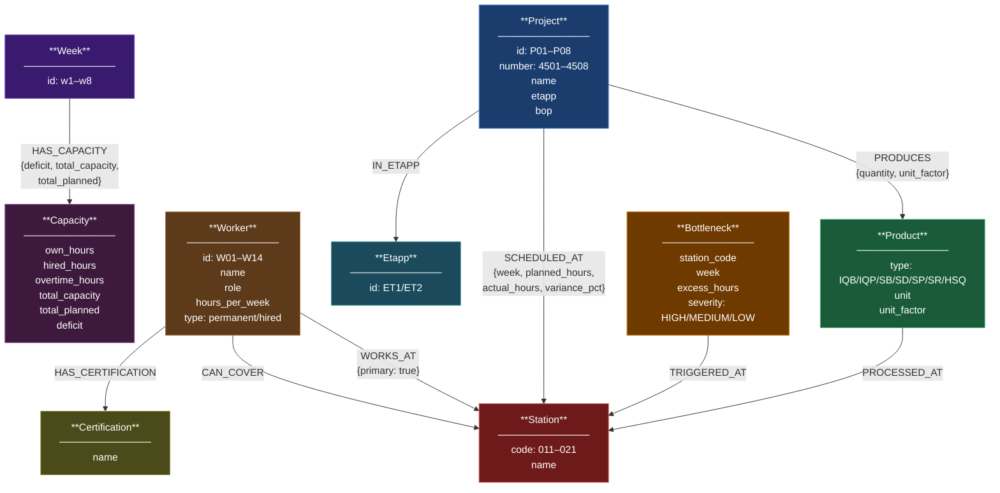

# Factory Knowledge Graph Schema



## Key Relationships with Properties

### SCHEDULED_AT (core operational relationship)
```
(P03:Project)-[:SCHEDULED_AT {
    week: "w2",
    planned_hours: 28.0,
    actual_hours: 35.0,
    completed_units: 8,
    variance_pct: 25.0
}]->(S016:Station {code: "016", name: "Gjutning"})
```
> 25% over plan — this is a HIGH bottleneck

### HAS_CAPACITY (weekly workforce data)
```
(w1:Week)-[:HAS_CAPACITY {
    own_hours: 400,
    hired_hours: 80,
    overtime_hours: 0,
    total_capacity: 480,
    total_planned: 612,
    deficit: -132
}]->(cap1:Capacity)
```
> Worst deficit week — 132 hours short

## Node Counts (from real data)

| Label | Count | Source |
|-------|-------|--------|
| Project | 8 | factory_production.csv |
| Product | 7 | factory_production.csv |
| Station | 9 | factory_production.csv |
| Worker | 14 | factory_workers.csv |
| Week | 8 | factory_capacity.csv |
| Etapp | 2 | factory_production.csv |
| Certification | ~12 | factory_workers.csv |
| Capacity | 8 | factory_capacity.csv |
| Bottleneck | ~4 | computed |
| **TOTAL** | **~72** | |

## Relationship Counts (estimated)

| Type | Count | Notes |
|------|-------|-------|
| SCHEDULED_AT | 68 | one per CSV row |
| PRODUCES | ~18 | project × product combos |
| PROCESSED_AT | ~12 | product × station combos |
| IN_ETAPP | 8 | one per project |
| WORKS_AT | ~20 | primary + foreman (all stations) |
| CAN_COVER | ~25 | coverage assignments |
| HAS_CERTIFICATION | ~30 | worker × cert combos |
| HAS_CAPACITY | 8 | one per week |
| TRIGGERED_AT | ~4 | bottleneck nodes |
| **TOTAL** | **~193** | |
```
