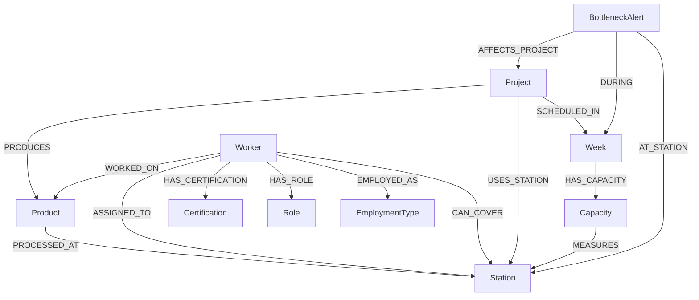

# Factory Knowledge Graph Schema



---

# Relationship Properties

## `WORKED_ON`

Properties:
- `actual_hours`
- `completed_units`
- `week`

Example:

```cypher
(:Worker)-[:WORKED_ON {
    actual_hours: 38.5,
    completed_units: 22,
    week: "w1"
}]->(:Product)
```

---

## `USES_STATION`

Properties:
- `planned_hours`
- `actual_hours`
- `variance_pct`
- `week`

Example:

```cypher
(:Project)-[:USES_STATION {
    planned_hours: 32,
    actual_hours: 38.2,
    variance_pct: 19.37,
    week: "w1"
}]->(:Station)
```

---

# Node Labels

## `:Project`

Represents fabrication or construction projects.

### Properties
- `project_id`
- `project_number`
- `project_name`

### CSV Source
`factory_production.csv`

---

## `:Product`

Represents manufactured product types.

### Properties
- `product_type`
- `unit`
- `quantity`
- `unit_factor`

### CSV Source
`factory_production.csv`

---

## `:Station`

Represents production stations inside the factory.

### Properties
- `station_code`
- `station_name`
- `etapp`
- `bop`

### CSV Source
`factory_production.csv`

---

## `:Worker`

Represents factory workers/operators.

### Properties
- `worker_id`
- `name`
- `hours_per_week`

### CSV Source
`factory_workers.csv`

---

## `:Week`

Represents production weeks.

### Properties
- `week`

### CSV Source
Both production + capacity CSVs

---

## `:Capacity`

Represents weekly production capacity metrics.

### Properties
- `own_staff_count`
- `hired_staff_count`
- `own_hours`
- `hired_hours`
- `overtime_hours`
- `total_capacity`
- `total_planned`
- `deficit`

### CSV Source
`factory_capacity.csv`

---

## `:Certification`

Represents worker certifications.

### Properties
- `name`

### Examples
- MIG/MAG
- TIG
- ISO 9606
- CE marking
- Hydraulics

### CSV Source
`factory_workers.csv`

---

## `:Role`

Represents worker roles.

### Properties
- `role`

### Examples
- Operator
- Supervisor

### CSV Source
`factory_workers.csv`

---

## `:EmploymentType`

Represents worker employment category.

### Properties
- `type`

### Examples
- permanent
- hired

### CSV Source
`factory_workers.csv`

---

## `:BottleneckAlert`

Represents overload or production variance alerts.

### Properties
- `severity`
- `variance_pct`
- `created_at`

---

# Relationship Types

| Relationship | From → To | Properties |
|---|---|---|
| `PRODUCES` | Project → Product | — |
| `PROCESSED_AT` | Product → Station | — |
| `SCHEDULED_IN` | Project → Week | — |
| `ASSIGNED_TO` | Worker → Station | — |
| `CAN_COVER` | Worker → Station | `coverage_priority` |
| `HAS_CERTIFICATION` | Worker → Certification | — |
| `HAS_ROLE` | Worker → Role | — |
| `EMPLOYED_AS` | Worker → EmploymentType | — |
| `WORKED_ON` | Worker → Product | `actual_hours`, `completed_units`, `week` |
| `USES_STATION` | Project → Station | `planned_hours`, `actual_hours`, `variance_pct`, `week` |
| `HAS_CAPACITY` | Week → Capacity | — |
| `MEASURES` | Capacity → Station | `load_pct` |
| `AFFECTS_PROJECT` | BottleneckAlert → Project | — |
| `AT_STATION` | BottleneckAlert → Station | — |
| `DURING` | BottleneckAlert → Week | — |

---

# Graph Design Rationale

## 1. Stations Are Core Operational Nodes

Stations are the operational bottlenecks of the factory.  
Modeling them as graph nodes enables:
- overload detection
- worker replacement analysis
- dependency tracing
- production flow visualization

---

## 2. Weeks Are Explicit Time Nodes

Weeks connect:
- production
- staffing
- capacity
- overtime
- bottleneck alerts

This supports temporal traversal and trend analysis.

---

## 3. Certifications Are Independent Entities

Separating certifications into nodes enables:
- certification-based staffing queries
- skill gap analysis
- substitute worker discovery
- compliance validation

---

## 4. Bottlenecks Are First-Class Graph Events

Instead of storing overloads as simple flags, bottlenecks become graph entities.

Benefits:
- historical tracking
- recurring overload detection
- impact propagation analysis
- operational alert dashboards

---

# CSV → Graph Mapping

| CSV File | Graph Nodes / Relationships |
|---|---|
| `factory_production.csv` | Project, Product, Station, Week, USES_STATION |
| `factory_workers.csv` | Worker, Certification, Role, EmploymentType |
| `factory_capacity.csv` | Capacity, Week |

---

# Example Traversals

## Find replacement workers for Station 016

```cypher
MATCH (w:Worker)-[:CAN_COVER]->(s:Station {station_code: "016"})
RETURN w.name;
```

---

## Find overloaded stations

```cypher
MATCH (p:Project)-[u:USES_STATION]->(s:Station)
WHERE u.actual_hours > u.planned_hours * 1.10
RETURN
    s.station_name,
    p.project_name,
    u.week,
    u.actual_hours,
    u.planned_hours;
```

---

## Find bottleneck impact chain

```cypher
MATCH (b:BottleneckAlert)-[:AT_STATION]->(s:Station)
MATCH (b)-[:AFFECTS_PROJECT]->(p:Project)
RETURN
    b.severity,
    s.station_name,
    p.project_name;
```
