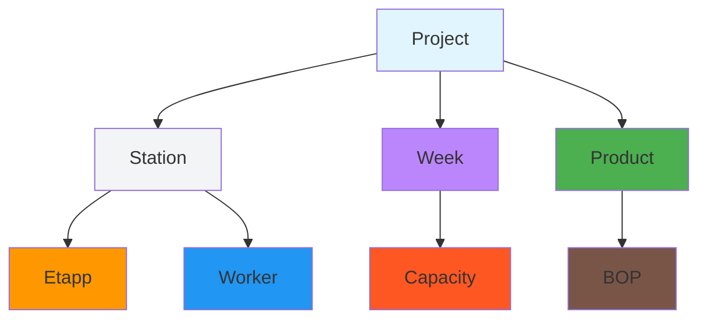

# Level 5 Answers - Factory Production Knowledge Graph

## Q1: Graph Schema Design

Based on actual CSV analysis, the schema must handle:

**Actual Entities:**
- Project (project_id, project_name, product_type, unit, quantity, station_code, station_name, etapp, bop, week, planned_hours, actual_hours, completed_units)
- Worker (worker_id, name, role, primary_station, can_cover_stations, certifications, hours_per_week, type)
- Station (inferred from station_code, station_name, etapp)
- Week (temporal dimension: w1-w8)
- Etapp (assembly, testing, etc.)
- BOP (Balance of Plant)
- Product (product_type: IQB, SB, SP, SR, etc.)
- Capacity (from factory_capacity.csv)

**Relationships from Data:**
- Project -> Station (station_code)
- Worker -> Station (primary_station, can_cover_stations)
- Project -> Week (week)
- Station -> Etapp (etapp)
- Week -> Capacity (deficit tracking)

**Schema Design:**


## Q2: SQL vs Cypher - Worker Coverage Analysis

**Question:** Which workers can cover Station 011 when Per Gustafsson is unavailable and which projects are affected?

**SQL Query:**
```sql
SELECT w.worker_id, w.name, w.can_cover_stations
FROM factory_workers w
WHERE w.can_cover_stations LIKE '%011%' 
AND w.worker_id != 'W01';

SELECT p.project_id, p.project_name, p.station_code
FROM factory_production p
WHERE p.station_code = '011' 
AND p.week IN (
    SELECT week FROM factory_production 
    WHERE station_code = '011'
    AND actual_hours > planned_hours
);
```

**Cypher Query:**
```cypher
// Find workers who can cover station 011
MATCH (w:Worker)
WHERE '011' IN w.can_cover_stations AND w.worker_id <> 'W01'
RETURN w.worker_id, w.name, w.can_cover_stations;

// Find projects affected when station 011 is unavailable
MATCH (p:Project)
WHERE p.station_code = '011'
WITH p
MATCH (week:Week)
WHERE p.week = week.week
AND EXISTS {
    MATCH (p2:Project)
    WHERE p2.station_code = '011' 
    AND p2.week = week.week
    AND p2.actual_hours > p2.planned_hours
}
RETURN p.project_id, p.project_name, p.station_code, week.week;
```

**Why Cypher is Better:**
- **Relationship Traversal**: Can follow worker->station->project relationships naturally
- **Pattern Matching**: `EXISTS` subquery cleaner than SQL JOIN
- **Path Analysis**: Can trace impact through multiple hops: `worker->station->project->week`
- **Flexibility**: Easy to add new relationship types without schema changes

## Q3: Bottleneck Analysis

**From factory_capacity.csv data:**
- Weeks w1-w2 have significant deficits: -132, -125 hours
- Week w3 has surplus: +82 hours
- Indicates capacity planning issues, not just station overload

**Bottleneck Model:**
```cypher
// Create bottleneck nodes where actual > planned by 10%
MATCH (c:Capacity)
WHERE c.deficit < -10
CREATE (b:Bottleneck {
    bottleneckId: 'B_' + c.week,
    type: 'CAPACITY_DEFICIT',
    severity: CASE 
        WHEN c.deficit < -100 THEN 'CRITICAL'
        WHEN c.deficit < -50 THEN 'HIGH'
        ELSE 'MEDIUM'
    END,
    description: c.week + ' capacity deficit of ' + ABS(c.deficit) + ' hours',
    impactRate: ABS(c.deficit) / c.total_planned,
    week = c.week
})
CREATE (c)-[:HAS_BOTTLENECK]->(b);

// Find stations with consistent overperformance
MATCH (s:Station)
WHERE s.station_code IN (
    MATCH (p:Project)-[:AT]->(s)
    WHERE p.actual_hours > p.planned_hours * 1.1
    WITH DISTINCT s.station_code as overperforming
    RETURN overperforming
)
MERGE (s)-[:HAS_PERFORMANCE_ISSUE]->(b:Bottleneck {
    type: 'CONSISTENT_OVERTIME',
    severity: 'MEDIUM'
});
```

## Q4: Hybrid Search

**Real Manufacturing Example:** "450 meters of IQB beams for hospital extension"

**Hybrid Search Design:**
```cypher
// Graph search: Find projects with IQB products
MATCH (p:Project)-[:PRODUCES]->(prod:Product)
WHERE prod.product_type = 'IQB'
WITH p, prod

// Vector similarity: Find similar beam projects
CALL db.index.vector.search('project_embeddings', $queryEmbedding, 10)
YIELD similarProject, similarity

// Metadata filtering: Filter by project scale
WHERE p.quantity >= 400 AND p.quantity <= 800
RETURN p, prod, similarProject, similarity
ORDER BY similarity DESC;
```

**Components:**
1. **Graph Search**: Exact product type matching (IQB)
2. **Vector Search**: Semantic similarity for "hospital extension"
3. **Metadata Filtering**: Project scale (400-800 units)
4. **Relationship Scoring**: Combine graph proximity with vector similarity

This approach handles both exact matches and semantic similarity while respecting manufacturing constraints.
