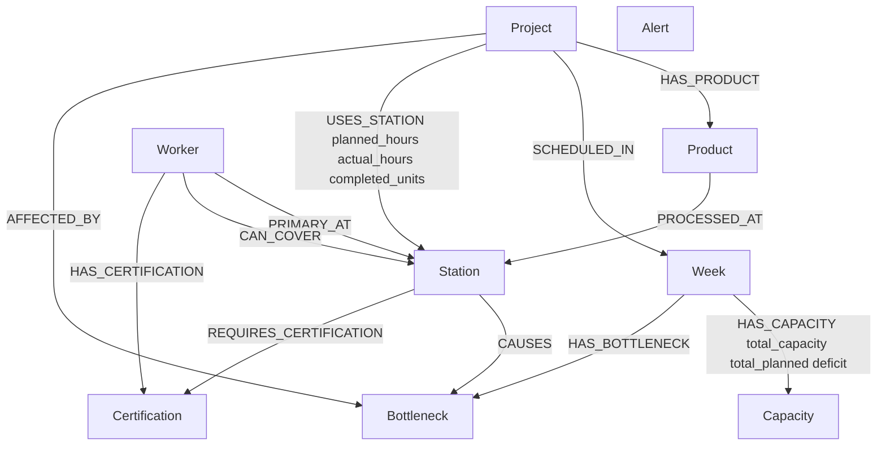

# Level 5 Graph Schema

```mermaid
graph TD
    Project["Project"]
    Product["Product"]
    Station["Station"]
    Worker["Worker"]
    Week["Week"]
    Capacity["Capacity"]
    Certification["Certification"]
    Bottleneck["Bottleneck"]
    Alert["Alert"]

    Project -->|HAS_PRODUCT| Product
    Project -->|SCHEDULED_IN| Week
    Project -->|USES_STATION planned_hours actual_hours completed_units| Station
    Product -->|PROCESSED_AT| Station
    Worker -->|PRIMARY_AT| Station
    Worker -->|CAN_COVER| Station
    Worker -->|HAS_CERTIFICATION| Certification
    Week -->|HAS_CAPACITY total_capacity total_planned deficit| Capacity
    Week -->|HAS_BOTTLENECK| Bottleneck
    Station -->|CAUSES| Bottleneck
    Project -->|AFFECTED_BY| Bottleneck
    Station -->|REQUIRES_CERTIFICATION| Certification
```