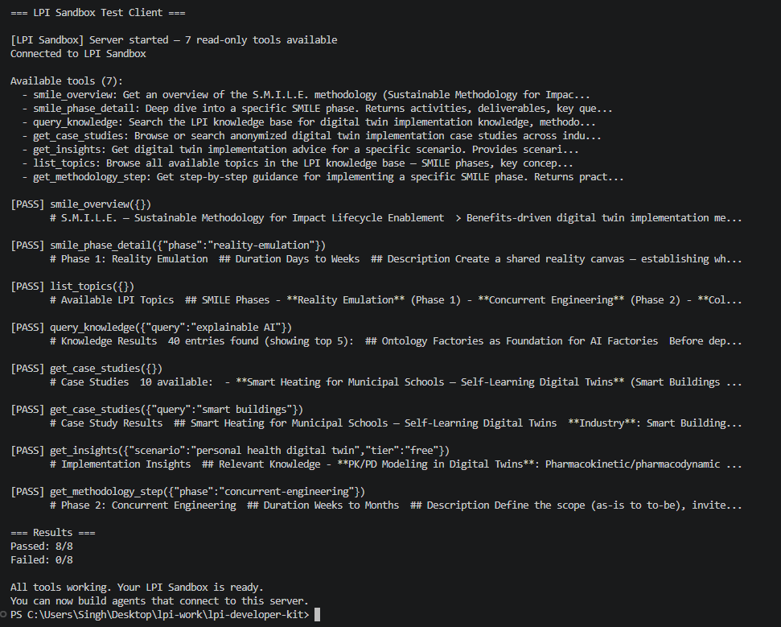
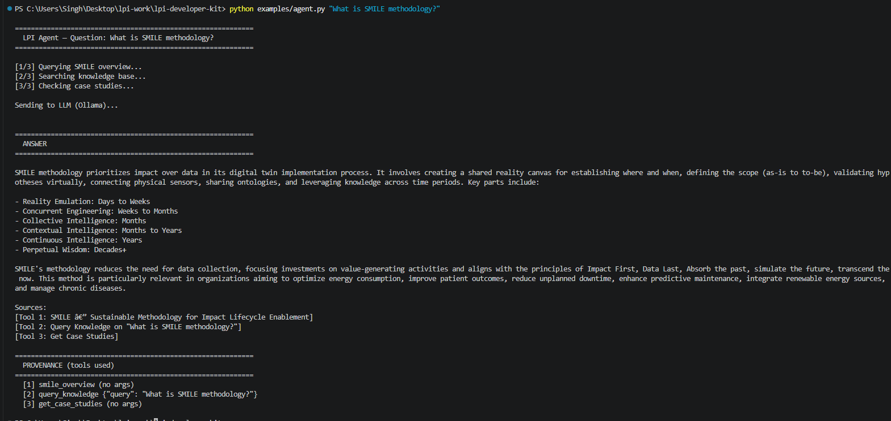

# Level 2 Submission — Jaivardhan Singh

## Test Client Output
All 7 tools passed successfully.

## LLM Output
Agent successfully answered the query using SMILE methodology tools.

## Reflection
1. I was surprised that the SMILE methodology provides a structured way to build digital twins step-by-step.
2. The ability of an AI agent to call multiple tools and combine results was very powerful.
3. Running a local LLM using Ollama without any API cost made the system practical and accessible.