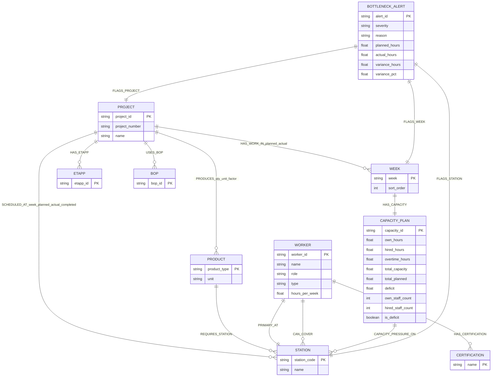

# Level 5 Schema Diagram — Factory Knowledge Graph

This Mermaid diagram is the schema design for Level 5. It uses the three CSV files in `challenges/data/` as the source of truth.

## Relationship Types and Main Properties

| Relationship | From → To | Main source | Important properties |
|---|---|---|---|
| `PRODUCES` | `Project → Product` | `factory_production.csv` | `quantity`, `unit`, `unit_factor` |
| `SCHEDULED_AT` | `Project → Station` | `factory_production.csv` | `week`, `planned_hours`, `actual_hours`, `completed_units`, `variance_hours`, `variance_pct`, `is_over_10pct` |
| `HAS_WORK_IN` | `Project → Week` | `factory_production.csv` | `planned_hours`, `actual_hours`, `station_count` |
| `HAS_ETAPP` | `Project → Etapp` | `factory_production.csv` | `etapp` |
| `USES_BOP` | `Project → BOP` | `factory_production.csv` | `bop` |
| `REQUIRES_STATION` | `Product → Station` | `factory_production.csv` | `times_seen`, `total_planned_hours`, `total_actual_hours` |
| `PRIMARY_AT` | `Worker → Station` | `factory_workers.csv` | `role`, `hours_per_week` |
| `CAN_COVER` | `Worker → Station` | `factory_workers.csv` | `is_primary`, `coverage_source`, `hours_per_week` |
| `HAS_CERTIFICATION` | `Worker → Certification` | `factory_workers.csv` | `certification_name` |
| `HAS_CAPACITY` | `Week → CapacityPlan` | `factory_capacity.csv` | `own_hours`, `hired_hours`, `overtime_hours`, `total_capacity`, `total_planned`, `deficit` |
| `CAPACITY_PRESSURE_ON` | `CapacityPlan → Station` | derived from production + capacity | `station_planned_hours`, `station_actual_hours`, `station_variance_hours`, `share_of_week_demand` |
| `FLAGS_PROJECT` | `BottleneckAlert → Project` | derived | `reason` |
| `FLAGS_STATION` | `BottleneckAlert → Station` | derived | `reason` |
| `FLAGS_WEEK` | `BottleneckAlert → Week` | derived | `reason` |

## Why this schema works

The graph separates stable business entities (`Project`, `Product`, `Station`, `Worker`, `Week`) from measured operational facts (`SCHEDULED_AT`, `HAS_CAPACITY`, `CAPACITY_PRESSURE_ON`, `BOTTLENECK_ALERT`). This makes it easy to answer both planning questions, such as “which stations are overloaded?”, and resilience questions, such as “who can cover a station if a worker is absent?”.
