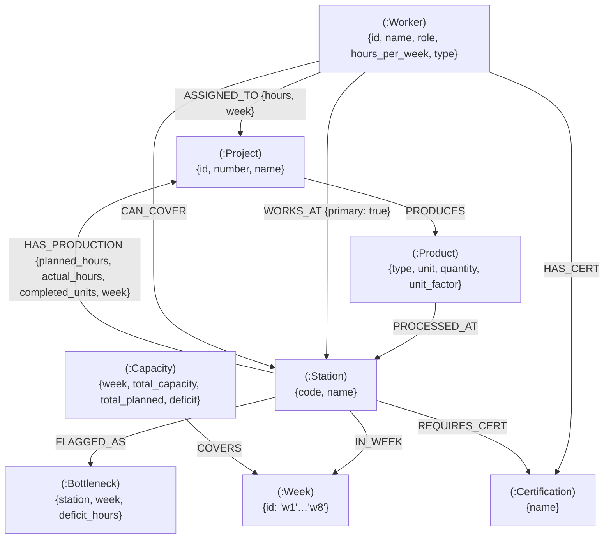

# Level 5 — Graph Thinking

## Q1. Model It 

Here's how I mapped out the factory's moving parts. I focused heavily on what actually matters on the floor—tracking production metrics, who's certified to do what, and catching those nasty capacity bottlenecks before they hit.



## Q2. Why Not Just SQL? 

**Scenario:** Find workers certified to cover Station 016 (Gjutning) when Per Gustafsson goes on vacation (used "Per Hansen" in the query), and figure out which projects are going to take a hit.

### 1. SQL Version

```sql
SELECT DISTINCT w.name AS Backup_Worker, p.project_name AS Affected_Project
FROM factory_workers w
JOIN factory_production prod ON (w.primary_station = '016' OR w.can_cover_stations LIKE '%016%')
JOIN projects p ON prod.project_id = p.project_id
WHERE prod.station_code = 16 
  AND w.name != 'Per Hansen';

```

### 2. Cypher Version

```cypher
MATCH (s:Station {code: "016"})
MATCH (backup:Worker)-[:CAN_COVER|WORKS_AT]->(s)
MATCH (s)-[:HAS_PRODUCTION]->(prj:Project)
WHERE backup.name <> "Per Hansen"
RETURN backup.name, collect(DISTINCT prj.name) AS affected_projects;

```

### 3. Comparison

The graph model makes the **physical and operational path** immediately obvious.

* **Mental Model:** It just feels way more intuitive—almost physical. Think about it: `Worker` → `CAN_COVER` → `Station` → `HAS_PRODUCTION` → `Project`. Your query literally mirrors how you'd naturally ask the question. You're just walking down a thread from the worker all the way to the affected project. SQL? Not so much. You're stuck mentally reverse-engineering this tangled mess of table joins just to figure out the same thing.
* **First-Class Concepts:** Where does something like "coverage" even live in SQL? Usually, it's not a first-class concept at all. It gets buried inside some junction table or shoved into a comma-separated string. A graph pulls that relationship out and makes it a tangible, visual thing.
* **Performance:** And then there's the performance angle. JOINs are expensive. They only drag more as your dataset grows. Graph traversals, on the other hand, are local operations. Even when you're digging deep to map out complex cross-station impacts, they stay fast.

## Q3. Spot the Bottleneck 

### 1. Identifying the Overload

Taking a look at `factory_capacity.csv`, we're getting hammered in **Week 1 (-132 hours)** and **Week 2 (-125 hours)**. Digging into the production data shows exactly why. It's a mix of too many projects demanding time all at once, plus some serious overruns where actual hours blew past the plan at a few key stations.

| Station | Project(s) | Key Overruns / Load |
| --- | --- | --- |
| **011 (FS IQB)** | P03, P05, P07, P08 | All running simultaneously in w1–w2; P03 alone accounts for 72 hrs and P05 for 95 hrs. |
| **016 (Gjutning)** | P03, P05, P07, P08 | Actual hours consistently exceed planned (e.g., 28 → 35, 35 → 40). |
| **014 (Svets o montage)** | P01, P03, P05, P08 | Significant overruns in w1 (38.2 vs 35, 48 vs 42, 62 vs 58, 44 vs 40). |
| **021 (SR B/F-hall)** | P01, P04 | SR units are heavy: 40 planned → 42 actual; 60 planned → 65 actual. |

### 2. Cypher Query for Alerting

If we want to catch these bottlenecks automatically, we just need to scan the graph for any job where the actual time took at least 10% longer than planned.

```cypher
MATCH (s:Station)-[hp:HAS_PRODUCTION]->(p:Project)
WHERE hp.actual_hours > (hp.planned_hours * 1.1)
RETURN s.name AS Station, 
       p.name AS Project, 
       hp.week AS Week,
       hp.planned_hours AS Planned, 
       hp.actual_hours AS Actual,
       (hp.actual_hours - hp.planned_hours) AS Overrun
ORDER BY Overrun DESC;

```

### 3. Modeling the Alert as a Pattern

Instead of recalculating this math every single time we look at the dashboard, I set up a **`(:Bottleneck)`** node that links back to the **`Station`** with a **`FLAGGED_AS`** relationship.

**Why do it this way?** Running variance math across thousands of rows is a massive waste of resources for a live dashboard. By dropping a persistent `Bottleneck` node the second a threshold gets crossed, we're taking a heavy calculation and turning it into a simple state. You get instant retrieval: `MATCH (s:Station)-[:FLAGGED_AS]->(b:Bottleneck)`. For real-time monitoring, this is a lifesaver. Your UI can just light up the "Red" stations on a 3D map or heatmap instantly—no heavy lifting required when the query runs.

## Q4. Vector + Graph Hybrid 

### 1. What to Embed?

I'd definitely embed the **Project Descriptions** and the **Product Specifications**. Sure, simple filters can tell you a project needs "IQB beams." But vector embeddings? They grab the actual **semantic complexity** of the job. There's a massive difference between a "hospital extension" and a "simple warehouse," even if they use similar parts. Vectors pick up on those subtle nuances—stuff like regulatory headaches or weird installation constraints—that completely slip through the cracks of standard CSV columns.

### 2. Hybrid Query

Here's how it plays out. The query hits the vector index to track down past projects with similar scopes. Then, it uses the graph to filter out the duds and only return the jobs we actually nailed operationally.

```cypher
// 1. Vector search for semantic similarity
CALL db.index.vector.queryNodes('project_descriptions', 5, $new_project_vector)
YIELD node AS past_project, score

// 2. Graph filter for operational efficiency
MATCH (past_project)-[hp:HAS_PRODUCTION]->(:Station)
WITH past_project, score, avg(hp.actual_hours / hp.planned_hours) AS variance
WHERE variance < 1.05 // Only consider projects with < 5% variance
RETURN past_project.name, score, variance
ORDER BY score DESC;

```

### 3. Why this is more useful than just filtering by product type

Just filtering by "Product Type" only tells you what you're building. It tells you nothing about how painful it'll be to actually build it. Going hybrid is much smarter here:

* **Contextual Matching:** You stop treating a high-security hospital and a basic shed like they're the same just because they use the same beams. It respects the complexity.
* **Performance Filtering:** You aren't just finding similar projects. You're finding similar projects *that went well*. We leverage the graph to calculate real-world variance, meaning our future estimates are built on historical wins, not disasters.
* **Stream Integration:** This is exactly the same playbook the Boardy team uses. They match people based on needs and offers using vectors, but they constrain it all within specific professional graph communities.

## Q5. Your L6 Plan 

### 1. Node Labels → CSV Columns

| Node Label | Source CSV | Key Columns |
| --- | --- | --- |
| **(:Project)** | factory_production | project_id, project_number, project_name |
| **(:Product)** | factory_production | product_type, unit, quantity, unit_factor |
| **(:Station)** | factory_production | station_code, station_name |
| **(:Worker)** | factory_workers | worker_id, name, role, hours_per_week, type |
| **(:Week)** | factory_capacity | week |
| **(:Capacity)** | factory_capacity | total_capacity, total_planned, deficit |
| **(:Certification)** | factory_workers | certifications (split by comma) |

### 2. Relationship Types → Logic

| Relationship | Created From |
| --- | --- |
| **(:Project)-[:PRODUCES]->(:Product)** | Unique project_id + product_type combos in production CSV |
| **(:Product)-[:PROCESSED_AT {metrics}]->(:Station)** | Each row in factory_production (carries planned/actual hours, week, units) |
| **(:Worker)-[:WORKS_AT {primary:true}]->(:Station)** | primary_station column in workers CSV |
| **(:Worker)-[:CAN_COVER]->(:Station)** | can_cover_stations list in workers CSV |
| **(:Worker)-[:HAS_CERT]->(:Certification)** | certifications list in workers CSV |
| **(:Capacity)-[:COVERS]->(:Week)** | factory_capacity rows |
| **(:Station)-[:FLAGGED_AS]->(:Bottleneck)** | Computed: actual > planned × 1.10 |

### 3. Streamlit Dashboard Panels

* **Panel 1 — Station Load Heatmap**: A simple grid showing stations by week. We'll color-code it based on how bad the overruns are.
* *Query*: `MATCH (s:Station)-[r:HAS_PRODUCTION]->(p:Project) RETURN s.code, r.week, sum(r.actual_hours) AS total_actual, sum(r.planned_hours) AS total_planned ORDER BY s.code, r.week`


* **Panel 2 — Capacity vs Demand Bar Chart**: Grouped bars for every week. Lets you spot the deficit weeks instantly.
* *Query*: `MATCH (c:Capacity)-[:COVERS]->(w:Week) RETURN w.id, c.total_capacity, c.total_planned, c.deficit ORDER BY w.id`


* **Panel 3 — Worker Coverage Matrix**: A matrix layout—workers on the rows, stations on the columns. Essential for figuring out who can cover when someone calls in sick.
* *Query*: `MATCH (w:Worker)-[:CAN_COVER]->(s:Station) RETURN w.name, collect(s.code) AS covered_stations, w.certifications ORDER BY w.name`
