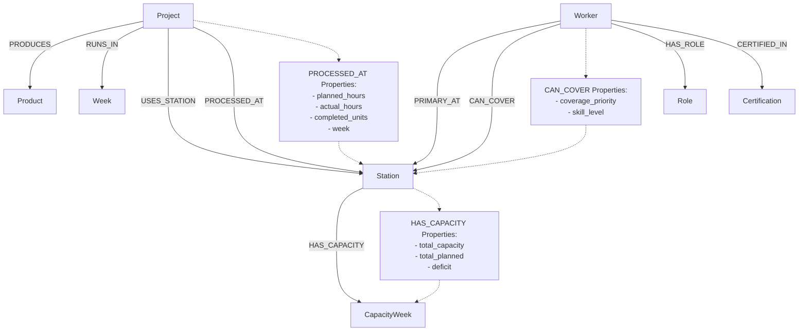

# Factory Production Knowledge Graph Schema

---

# Node Labels

## 1. Project
Represents factory production projects.

### Properties
- project_id
- project_number
- project_name

---

## 2. Product
Represents manufactured product types.

### Properties
- product_type
- unit
- quantity
- unit_factor

---

## 3. Station
Represents factory production stations.

### Properties
- station_code
- station_name

---

## 4. Worker
Represents factory workers/operators.

### Properties
- worker_id
- worker_name
- worker_type
- hours_per_week

---

## 5. Week
Represents production weeks.

### Properties
- week_id

---

## 6. Certification
Represents worker certifications.

### Properties
- certification_name

---

## 7. Role
Represents worker roles.

### Properties
- role_name

---

## 8. CapacityWeek
Represents weekly station capacity analysis.

### Properties
- week
- total_capacity
- total_planned
- deficit

---

# Relationship Types

## 1. (:Project)-[:PRODUCES]->(:Product)
A project produces a specific product type.

---

## 2. (:Project)-[:USES_STATION]->(:Station)
A project uses a production station.

---

## 3. (:Project)-[:RUNS_IN]->(:Week)
A project runs during a specific production week.

---

## 4. (:Project)-[:PROCESSED_AT]->(:Station)

### Relationship Properties
- planned_hours
- actual_hours
- completed_units
- week

Tracks production workload and variance at stations.

---

## 5. (:Worker)-[:PRIMARY_AT]->(:Station)
Represents the worker’s primary station assignment.

---

## 6. (:Worker)-[:CAN_COVER]->(:Station)

### Relationship Properties
- coverage_priority
- skill_level

Represents backup station coverage capability.

---

## 7. (:Worker)-[:HAS_ROLE]->(:Role)
Represents worker job role.

---

## 8. (:Worker)-[:CERTIFIED_IN]->(:Certification)
Represents worker certifications.

---

## 9. (:Station)-[:HAS_CAPACITY]->(:CapacityWeek)

### Relationship Properties
- total_capacity
- total_planned
- deficit

Tracks station overload and capacity deficit.

---

# Why This Schema Fits the Dataset

This graph structure models the core factory workflow:

- Projects are processed through production stations
- Workers operate and cover stations
- Stations experience varying workload and capacity pressure
- Production variance is captured directly on relationships
- Worker coverage and bottleneck analysis become easy to query

The schema is optimized for:
- bottleneck detection
- worker replacement analysis
- project variance tracking
- hybrid graph + vector search in Level 6
