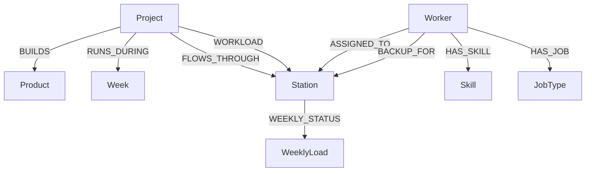

# Factory Production Knowledge Graph Schema

---

# Node Labels

## Project
Represents customer production projects handled by the factory.

### Properties
- project_id
- project_number
- project_name

---

## Product
Represents the type of structural product being manufactured.

### Properties
- product_type
- quantity
- unit
- unit_factor

---

## Station
Represents production stations inside the factory workflow.

### Properties
- station_code
- station_name

---

## Worker
Represents factory workers and operators.

### Properties
- worker_id
- worker_name
- hours_per_week
- worker_type

---

## Week
Represents production planning weeks.

### Properties
- week_id

---

## Skill
Represents certifications and technical worker capabilities.

### Properties
- skill_name

---

## JobType
Represents worker responsibility category.

### Properties
- role_name

---

## WeeklyLoad
Represents weekly factory load and capacity conditions.

### Properties
- total_capacity
- total_planned
- deficit

---

# Relationship Types

## (:Project)-[:BUILDS]->(:Product)

Connects projects to the products being manufactured.

---

## (:Project)-[:RUNS_DURING]->(:Week)

Tracks which production weeks a project is active.

---

## (:Project)-[:FLOWS_THROUGH]->(:Station)

Represents station routing inside the production process.

---

## (:Project)-[:WORKLOAD]->(:Station)

### Relationship Properties
- planned_hours
- actual_hours
- completed_units
- week

Stores operational production metrics directly on relationships.

---

## (:Worker)-[:ASSIGNED_TO]->(:Station)

Represents primary worker allocation.

---

## (:Worker)-[:BACKUP_FOR]->(:Station)

### Relationship Properties
- priority
- efficiency

Represents worker backup coverage capability for staffing gaps.

---

## (:Worker)-[:HAS_SKILL]->(:Skill)

Tracks technical certifications and qualifications.

---

## (:Worker)-[:HAS_JOB]->(:JobType)

Represents worker role category inside the factory.

---

## (:Station)-[:WEEKLY_STATUS]->(:WeeklyLoad)

### Relationship Properties
- capacity
- planned
- deficit

Tracks overload conditions and weekly station pressure.

---

# Why I Designed the Graph This Way

The dataset models production flow across multiple factory stations over several weeks.

Instead of treating the data as isolated tables, I modeled the graph around operational movement through the factory.

This structure makes it easier to:

- identify overloaded stations
- trace which projects created bottlenecks
- analyze production variance
- check backup worker coverage
- monitor weekly capacity pressure

I separated workers, skills, and station assignments because staffing flexibility is a critical operational problem in manufacturing systems.

One design decision I made was storing production variance directly on relationships instead of creating separate variance nodes. This simplifies Cypher aggregation queries and improves dashboard performance for bottleneck analysis.

The schema is also designed to support future hybrid graph + vector search workflows in Level 6.
