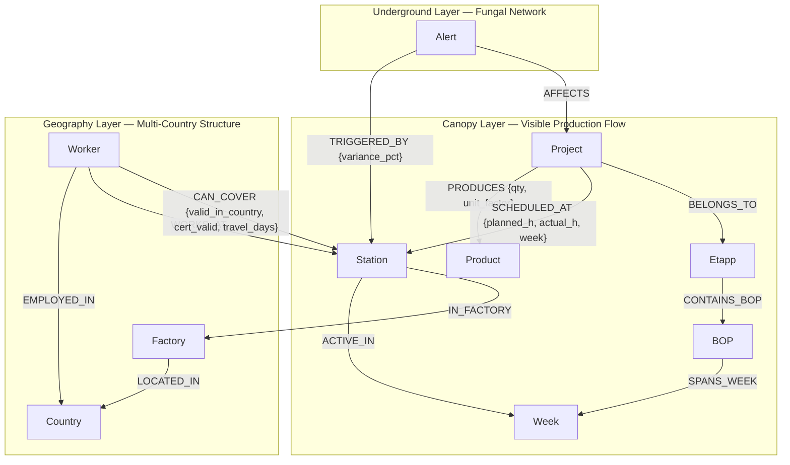

# Level 5 — Graph Thinking: Complete Answers

---

## Q1. Model It (20 pts)

### Biomimicry Inspiration — The Wood Wide Web

This schema is structured in three layers, inspired by how forests communicate through
underground fungal (mycorrhizal) networks — the "Wood Wide Web."

In a forest:
- Trees above ground do the visible work (photosynthesis, growth, fruit)
- Underground, an invisible fungal network connects all roots
- The network transfers nutrients from strong trees to struggling ones
- When a tree is attacked, it sends a chemical distress signal through the network
- If one path breaks, the network reroutes through other connections

This factory works the same way:

| Forest concept | Factory equivalent |
|---|---|
| Canopy — visible work | Projects producing Products at Stations |
| Fungal network — invisible connections | Worker CAN_COVER relationships |
| Mother tree — central hub | Victor Elm (covers all stations) + Station 011 (every project passes through it) |
| Distress signal | Alert node fires when actual_hours > planned × 1.10 |
| Ecosystem boundary | Country node — certifications and labor law don't cross borders automatically |
| Nutrient flow | Hours flowing through SCHEDULED_AT relationships |
| Single point of failure | Station 016 — only Per Hansen covers it |

Because factories are located in **different countries**, the schema adds a Geography
layer between the canopy and the underground. Worker coverage (the fungal network) cannot
cross country boundaries freely — it must check legal jurisdiction, certification
validity, and travel time first. Like mycelium that does not cross ecosystem boundaries.

---

### Node Labels (10 total — minimum required: 6)

| Node | CSV Source | Key Properties | Forest Analogy |
|------|-----------|---------------|----------------|
| `Project` | factory_production.csv | id, name, number | forest region |
| `Product` | factory_production.csv | type, unit | fruit / output |
| `Station` | factory_production.csv | code, name | nutrient hub |
| `Week` | factory_capacity.csv | name, own_hours, hired_hours, overtime_hours, total_capacity, total_planned, deficit | season / growth cycle |
| `Etapp` | factory_production.csv | name (ET1, ET2) | growth phase |
| `BOP` | factory_production.csv | name (BOP1, BOP2…) | sub-branch |
| `Country` | multi-country constraint | name, code, timezone, currency, labor_law | ecosystem boundary |
| `Factory` | multi-country constraint | name, city | individual tree |
| `Worker` | factory_workers.csv | id, name, role, certifications (list), hours_per_week, type | tree in the network |
| `Alert` | computed when actual > planned × 1.10 | variance_pct, week, type | distress signal |

**Worker node — certifications stored as a list, not a string:**

```cypher
MERGE (w:Worker {id: "W01"})
SET w.name           = "Erik Lindberg",
    w.role           = "Operator",
    w.certifications = ["MIG/MAG", "TIG", "ISO 9606"],
    w.hours_per_week = 40,
    w.type           = "permanent"
```

Storing as a list means you can query `WHERE "ISO 9606" IN w.certifications` — essential
for the multi-country certification checks.

---

### Relationship Types (13 total — minimum required: 8)

| Relationship | Direction | Data Carried | Layer |
|---|---|---|---|
| `PRODUCES` | Project → Product | quantity, unit_factor | Canopy |
| `SCHEDULED_AT` | Project → Station | planned_hours, actual_hours, week, variance_pct | Canopy |
| `BELONGS_TO` | Project → Etapp | — | Canopy |
| `CONTAINS_BOP` | Etapp → BOP | — | Canopy |
| `SPANS_WEEK` | BOP → Week | — | Canopy |
| `ACTIVE_IN` | Station → Week | — | Canopy |
| `LOCATED_IN` | Factory → Country | — | Geography |
| `IN_FACTORY` | Station → Factory | — | Geography |
| `EMPLOYED_IN` | Worker → Country | — | Geography |
| `WORKS_AT` | Worker → Station | — | Underground |
| `CAN_COVER` | Worker → Station | valid_in_country, cert_valid, travel_days | Underground (fungal) |
| `TRIGGERED_BY` | Alert → Station | variance_pct | Underground |
| `AFFECTS` | Alert → Project | — | Underground |

**SCHEDULED_AT — the heartbeat of the system (carries the most important data):**

```cypher
(p:Project)-[:SCHEDULED_AT {
    week:          "w1",
    planned_hours: 42.0,
    actual_hours:  48.0,
    variance_pct:  14.3
}]->(s:Station)
```

**CAN_COVER — the fungal network, now with country constraints:**

```cypher
(w:Worker)-[:CAN_COVER {
    valid_in_country: "SE",
    cert_valid:       true,
    travel_days:      0
}]->(s:Station)
```

The `CAN_COVER` relationship is drawn as a dashed line — like the fungal network it is
underground and invisible until something goes wrong. It only becomes critical when a
worker is absent and the manager asks: who can cover, is legally allowed to, and can
physically arrive in time?

---

### Schema Diagram (Mermaid)



---

## Q2. Why Not Just SQL? (20 pts)

### The Query

*"Which workers are certified to cover Station 016 (Gjutning) when Per Hansen is on
vacation, and which projects would be affected?"*

---

### SQL Version

Assumes reasonable tables:
`workers`, `stations`, `worker_coverage` (junction table), `production`, `projects`

```sql
SELECT
    w.name            AS covering_worker,
    w.certifications  AS certifications,
    p.project_name    AS affected_project
FROM workers w
JOIN worker_coverage wc  ON w.worker_id    = wc.worker_id
JOIN stations s          ON wc.station_id  = s.station_id
JOIN production prod     ON s.station_id   = prod.station_id
JOIN projects p          ON prod.project_id = p.project_id
WHERE s.station_code = '016'
  AND w.worker_id != (
      SELECT worker_id
      FROM workers
      WHERE name = 'Per Hansen'
  );
```

---

### Basic Cypher Version

```cypher
MATCH (cover:Worker)-[:CAN_COVER]->(s:Station {code: '016'})
WHERE cover.name <> 'Per Hansen'
MATCH (p:Project)-[:SCHEDULED_AT]->(s)
RETURN cover.name           AS covering_worker,
       cover.certifications AS certifications,
       collect(p.name)      AS affected_projects
```

---

### Multi-Country Cypher Version (reflects real factory constraint)

```cypher
MATCH (cover:Worker)-[c:CAN_COVER]->(s:Station {code: '016'})
MATCH (s)-[:IN_FACTORY]->(f:Factory)-[:LOCATED_IN]->(country:Country)
WHERE cover.name <> 'Per Hansen'
  AND c.valid_in_country = country.code
  AND c.cert_valid = true
  AND c.travel_days <= 1
WITH cover, c, s
MATCH (p:Project)-[:SCHEDULED_AT]->(s)
RETURN cover.name        AS covering_worker,
       c.travel_days     AS days_travel_needed,
       collect(p.name)   AS affected_projects
ORDER BY c.travel_days ASC
```

---

### What the graph makes obvious that SQL hides

**First:** In SQL, the relationship between workers and projects is completely invisible.
You discover it only by chaining four JOINs through intermediate tables. The query is
technically correct but structurally opaque — you have to mentally reconstruct the
connection by reading three table definitions. In Cypher, you follow two natural hops:
`CAN_COVER` to find coverage, `SCHEDULED_AT` back to find affected projects. The path
is the query.

**Second:** SQL completely hides the single-point-of-failure problem. You would only
discover that Per Hansen is the only person covering Station 016 by running a completely
separate COUNT query. In the graph, you can see it structurally — only one `CAN_COVER`
arrow points to that node. The danger is visible in the shape of the graph itself.

**Third:** The multi-country constraints — legal jurisdiction, certification validity,
travel time — would require two additional JOINs in SQL with no structural reason why
those three conditions belong together. In the graph, they live naturally on the
`CAN_COVER` relationship as properties, because they are all properties of the same
real-world fact: this worker can or cannot cover this station under these conditions.

---

## Q3. Spot the Bottleneck (20 pts)

### Part 1 — Which weeks, projects and stations are causing the overload

**Weekly capacity — 5 out of 8 weeks in deficit:**

| Week | Available | Planned | Deficit | Status |
|------|-----------|---------|---------|--------|
| w1 | 480h | 612h | **−132h** | 🔴 worst week |
| w2 | 520h | 645h | **−125h** | 🔴 critical |
| w3 | 480h | 398h | +82h | 🟢 fine |
| w4 | 500h | 550h | **−50h** | 🔴 over |
| w5 | 510h | 480h | +30h | 🟢 fine |
| w6 | 440h | 520h | **−80h** | 🔴 over |
| w7 | 520h | 600h | **−80h** | 🔴 over |
| w8 | 500h | 470h | +30h | 🟢 fine |

**Root cause — Station 016 (Gjutning) — worst overrun station:**

| Project | Week | Planned | Actual | Overrun |
|---------|------|---------|--------|---------|
| P03 Lagerhall Jönköping | w2 | 28h | 35h | **+25%** 🔴 |
| P05 Sjukhus Linköping | w2 | 35h | 40h | **+14%** 🔴 |
| P07 Idrottshall Västerås | w2 | 20h | 22h | +10% |
| P08 Bro E6 Halmstad | w3 | 22h | 25h | **+14%** 🔴 |

Station 016 is also a single point of failure — only Per Hansen covers it. When it
overloads AND he is absent, the fungal network has no valid rerouting path unless
a cross-country certified backup exists.

**Root cause — Station 014 (Svets o montage IQB):**

| Project | Week | Planned | Actual | Overrun |
|---------|------|---------|--------|---------|
| P03 Lagerhall Jönköping | w1 | 42h | 48h | **+14%** 🔴 |
| P05 Sjukhus Linköping | w1 | 58h | 62h | +7% |
| P08 Bro E6 Halmstad | w1 | 40h | 44h | +10% |

**Root cause — Station 011 (FS IQB) — volume problem:**
Every single project passes through Station 011. No single project overruns badly, but
the combined load in w1 and w2 makes it the mother tree of the factory — the hub that
everything depends on. If Station 011 goes down, all 8 projects are affected.

---

### Part 2 — Cypher query

```cypher
MATCH (p:Project)-[r:SCHEDULED_AT]->(s:Station)
WHERE r.actual_hours > r.planned_hours * 1.1
RETURN
    s.name                   AS station,
    collect(p.name)          AS overloaded_projects,
    round(
        avg(
            (r.actual_hours - r.planned_hours)
            / r.planned_hours * 100
        )
    )                        AS avg_overrun_pct
ORDER BY avg_overrun_pct DESC
```

**Expected output:**

| Station | Projects | Avg overrun % |
|---------|----------|--------------|
| Gjutning 016 | P03, P05, P07, P08 | +16% |
| Svets o montage 014 | P03, P05, P08 | +10% |

---

### Part 3 — Alert as a graph pattern

The alert is modeled as a **first-class node**, not just a flag on a relationship. This
is the biomimicry insight: in the forest, a distress signal travels through the fungal
network to reach workers who can respond. A number in a table cannot travel anywhere.

```cypher
MATCH (p:Project)-[r:SCHEDULED_AT]->(s:Station)
WHERE r.actual_hours > r.planned_hours * 1.1
MERGE (a:Alert {station_code: s.code, week: r.week})
SET   a.variance_pct = round(
          (r.actual_hours - r.planned_hours) / r.planned_hours * 100
      ),
      a.type = 'overrun'
MERGE (a)-[:TRIGGERED_BY]->(s)
MERGE (a)-[:AFFECTS]->(p)
```

Once `Alert` exists as a node, you can:
- Query all active alerts: `MATCH (a:Alert) RETURN a ORDER BY a.variance_pct DESC`
- Find who can resolve it: `TRIGGERED_BY` → Station → reverse `CAN_COVER` → Worker
- Apply multi-country filter: `WHERE c.valid_in_country = country.code`
- Track resolution: add `(a)-[:RESOLVED_BY]->(Worker)` when assigned
- Chain alerts: if Station 016 is overloaded and Per Hansen is absent, the alert
  propagates to projects AND triggers the backup search simultaneously

---

## Q4. Vector + Graph Hybrid (20 pts)

### Part 1 — What to embed

Embed **project descriptions** built by combining multiple CSV fields into one sentence:

```
"P03 — 900m IQB warehouse Jönköping ET1,
 stations: 011 012 013 014 016 017 018,
 8 weeks, large-scale, avg variance +5%"
```

This captures: product type, quantity, scale, building category, location, stations used,
and execution quality — the full fingerprint of a project, not just the product code.

Do NOT embed just `product_type`. Two projects can both use IQB beams and be completely
different in complexity, risk, and outcome. The embedding must encode how the project
behaved, not just what it made.

---

### Part 2 — Hybrid query combining vector + graph

```cypher
// Step 1: vector similarity search finds 5 most similar past projects
CALL db.index.vector.queryNodes(
    'project_embeddings',
    5,
    $query_vector
)
YIELD node AS similar_project, score

// Step 2: graph filter — variance under 5% (well-executed projects only)
MATCH (similar_project)-[r:SCHEDULED_AT]->(s:Station)
WHERE abs(r.actual_hours - r.planned_hours)
      / r.planned_hours <= 0.05

// Step 3: multi-country filter — stations are in a reachable jurisdiction
MATCH (s)-[:IN_FACTORY]->(f:Factory)-[:LOCATED_IN]->(c:Country)

RETURN similar_project.name AS reference_project,
       score                AS similarity_score,
       collect(s.name)      AS stations_used,
       c.name               AS country
ORDER BY score DESC
```

**Three-step logic:**
1. Vector narrows the field to similar-scope projects
2. Graph removes projects that ran badly (variance > 5%)
3. Geography layer checks the stations are in a legally accessible country

---

### Part 3 — Why better than filtering by product type

Filtering by product type returns all projects that used IQB beams. That includes P03
Lagerhall Jönköping (ran 25% over at Station 016) and P05 Sjukhus Linköping (ran cleanly
at +3%). Both use IQB beams. Product type filtering cannot distinguish them.

Vector similarity finds projects that **behaved** similarly — same scope, same scale, same
risk profile — because the embedding captures the full fingerprint of a project. The graph
layer then ensures only well-executed past projects are surfaced. You get projects worth
copying, not just projects that used the same materials.

**The Boardy parallel:**
The exact same pattern applies to people matching. Instead of project descriptions, embed
person profiles (skills + interests + needs). Vector search finds people with
complementary profiles. Graph filtering checks: not already teammates, same network
community, schedules compatible. Neither step works alone — vector narrows the field,
graph enforces real-world constraints.

---

## Q5. Your L6 Plan (20 pts)

### Part 1 — Node labels and CSV column mapping

| Node | CSV File | Columns | Notes |
|------|----------|---------|-------|
| `Project` | factory_production.csv | project_id, project_number, project_name | one node per unique project_id |
| `Product` | factory_production.csv | product_type, unit | one node per unique product_type |
| `Station` | factory_production.csv | station_code, station_name | one node per unique station_code |
| `Week` | factory_capacity.csv | week + all capacity columns | enriched with own_hours, hired_hours, overtime_hours, total_capacity, total_planned, deficit |
| `Etapp` | factory_production.csv | etapp | ET1 and ET2 |
| `BOP` | factory_production.csv | bop | BOP1, BOP2, BOP3 |
| `Worker` | factory_workers.csv | all columns | certifications split into list |
| `Country` | inferred | SE as base | extended when other country data available |
| `Factory` | inferred | one per physical production site | links stations to countries |
| `Alert` | computed | actual_hours vs planned_hours | created by seed_graph.py logic, not from CSV |

**Special case — Victor Elm:**
His primary_station is "all" in the CSV. The seed script creates `WORKS_AT` and
`CAN_COVER` relationships to every station rather than storing "all" as a string.

---

### Part 2 — Relationship types and what creates them

| Relationship | Created when | Data on relationship |
|---|---|---|
| `(Project)-[:PRODUCES]->(Product)` | Each unique project + product_type combination | quantity, unit_factor |
| `(Project)-[:SCHEDULED_AT]->(Station)` | Every row in factory_production.csv | planned_hours, actual_hours, week, variance_pct |
| `(Project)-[:BELONGS_TO]->(Etapp)` | etapp column on each production row | — |
| `(Etapp)-[:CONTAINS_BOP]->(BOP)` | bop column on each production row | — |
| `(BOP)-[:SPANS_WEEK]->(Week)` | bop + week columns together | — |
| `(Station)-[:ACTIVE_IN]->(Week)` | station_code + week on each row | — |
| `(Factory)-[:LOCATED_IN]->(Country)` | factory setup (once per factory) | — |
| `(Station)-[:IN_FACTORY]->(Factory)` | station to factory mapping | — |
| `(Worker)-[:EMPLOYED_IN]->(Country)` | worker type + jurisdiction | — |
| `(Worker)-[:WORKS_AT]->(Station)` | primary_station column | — |
| `(Worker)-[:CAN_COVER]->(Station)` | each code in can_cover_stations, split by comma | valid_in_country, cert_valid, travel_days |
| `(Alert)-[:TRIGGERED_BY]->(Station)` | computed: actual > planned × 1.10 | variance_pct |
| `(Alert)-[:AFFECTS]->(Project)` | same computation | — |

---

### Part 3 — Dashboard panels (4 panels)

**Panel 1 — Project Overview**
All 8 projects with planned hours, actual hours, and variance %. Bar chart coloured
green (under budget) / yellow (0–10% over) / red (>10% over). Manager opens this first
thing Monday to see which projects need immediate attention.

**Panel 2 — Station Load Heatmap**
Grid: stations on one axis, weeks on the other, colour intensity = total actual hours.
Dark red = overloaded. Interactive — click a cell to see which projects are contributing
to that station in that week.

**Panel 3 — Capacity Tracker**
Line chart: available hours vs planned demand across 8 weeks. Deficit weeks shaded red.
Stacked bar below it showing own staff vs hired vs overtime breakdown. Tells the manager
when to approve overtime or bring in hired workers.

**Panel 4 — Worker Coverage Matrix**
Table: every worker against every station, tick where they can cover. Stations with only
one tick highlighted red (single point of failure). Warning banner when a red station
also has an active Alert node — means the station is both overloaded AND has no backup.

---

### Part 4 — Cypher queries powering each panel

**Panel 1 — Project Overview:**
```cypher
MATCH (p:Project)-[r:SCHEDULED_AT]->(s:Station)
RETURN p.name               AS project,
       sum(r.planned_hours) AS planned,
       sum(r.actual_hours)  AS actual,
       round(
           (sum(r.actual_hours) - sum(r.planned_hours))
           / sum(r.planned_hours) * 100
       )                    AS variance_pct
ORDER BY p.id
```

**Panel 2 — Station Load Heatmap:**
```cypher
MATCH (p:Project)-[r:SCHEDULED_AT]->(s:Station)
RETURN s.name              AS station,
       r.week               AS week,
       sum(r.actual_hours)  AS total_actual_hours
ORDER BY station, week
```

**Panel 3 — Capacity Tracker:**
```cypher
MATCH (wk:Week)
WHERE wk.total_capacity IS NOT NULL
RETURN wk.name           AS week,
       wk.own_hours      AS own,
       wk.hired_hours    AS hired,
       wk.overtime_hours AS overtime,
       wk.total_capacity AS available,
       wk.total_planned  AS planned,
       wk.deficit        AS deficit
ORDER BY wk.name
```

**Panel 4 — Coverage Matrix:**
```cypher
MATCH (w:Worker)-[:CAN_COVER]->(s:Station)
RETURN w.name          AS worker,
       collect(s.code) AS covered_stations
```

**Panel 4 — Single point of failure warning:**
```cypher
MATCH (w:Worker)-[:CAN_COVER]->(s:Station)
WITH s, count(w) AS coverage_count
WHERE coverage_count = 1
MATCH (w2:Worker)-[:CAN_COVER]->(s)
RETURN s.code  AS station_code,
       s.name  AS station_name,
       w2.name AS only_worker
```

**Panel 4 — Multi-country backup finder:**
```cypher
MATCH (cover:Worker)-[c:CAN_COVER]->(s:Station {code: '016'})
MATCH (s)-[:IN_FACTORY]->(f:Factory)-[:LOCATED_IN]->(country:Country)
WHERE c.valid_in_country = country.code
  AND c.cert_valid = true
  AND c.travel_days <= 1
RETURN cover.name    AS valid_backup,
       c.travel_days AS days_needed,
       country.name  AS jurisdiction
ORDER BY c.travel_days ASC
```

---

*Schema diagram: see schema.md in the same folder.*
*Level 6 implementation: see seed_graph.py and app.py.*
