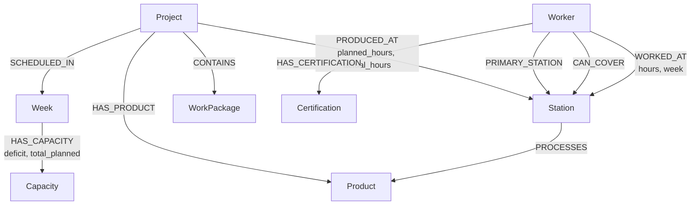

# Graph Schema — Factory Production

```mermaid
graph TD
    Project -->|HAS_PRODUCT| Product
    Project -->|SCHEDULED_IN| Week
    Project -->|PRODUCED_AT\nplanned_hours, actual_hours| Station
    Project -->|CONTAINS| WorkPackage
    Worker -->|PRIMARY_STATION| Station
    Worker -->|CAN_COVER| Station
    Worker -->|HAS_CERTIFICATION| Certification
    Worker -->|WORKED_AT\nhours, week| Station
    Station -->|PROCESSES| Product
    Week -->|HAS_CAPACITY\ndeficit, total_planned| Capacity
```