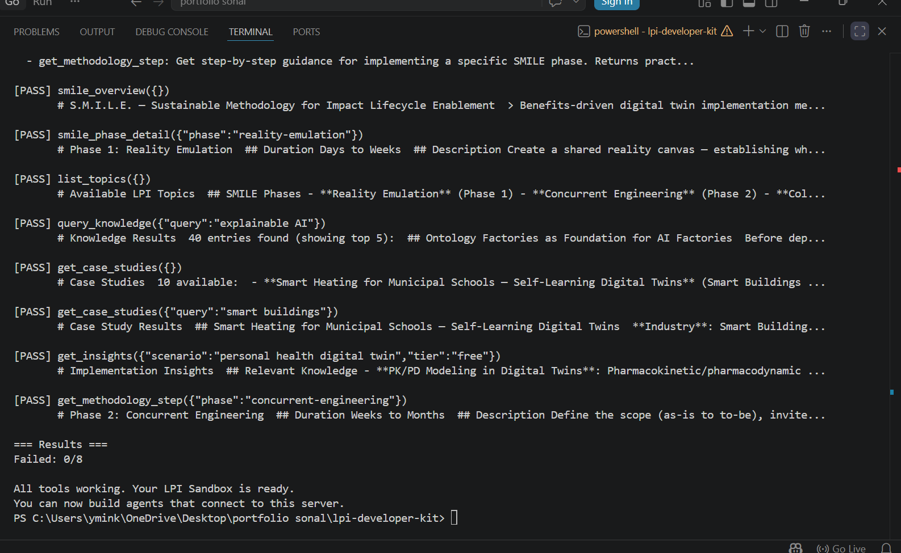
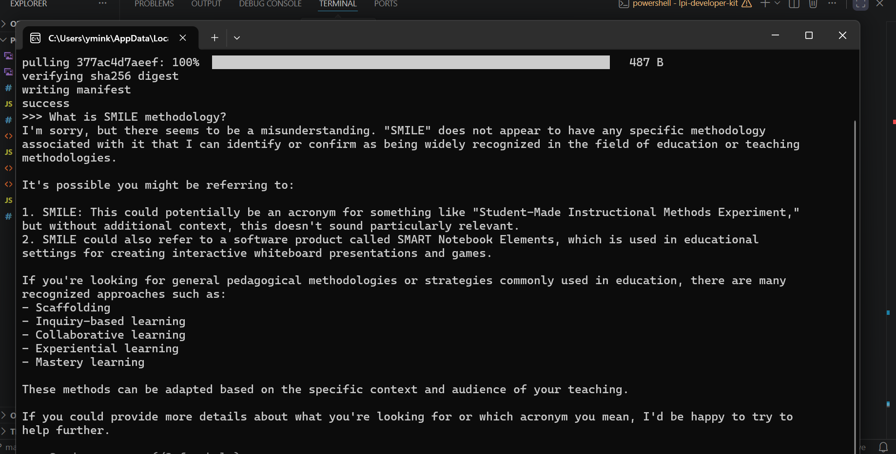

## What I Did

I set up the LPI sandbox by cloning the repository and installing dependencies using npm. I built the project and ran the test client, which confirmed that all tools are working correctly.

I also installed Ollama and ran a local LLM (qwen2.5:1.5b). I tested it by asking a question about the SMILE methodology and observed how it responded.

## Challenges Faced

Initially, I faced issues with navigating folders and setting up the environment, but I resolved them by correctly cloning the repository and working in the right directory.

## What I Learned

I learned how to run an AI sandbox locally and how tools can be tested using a client. I also observed that the local LLM did not correctly recognize the SMILE methodology, which shows that smaller models may lack domain-specific knowledge without proper context or tool integration.

## Screenshots

