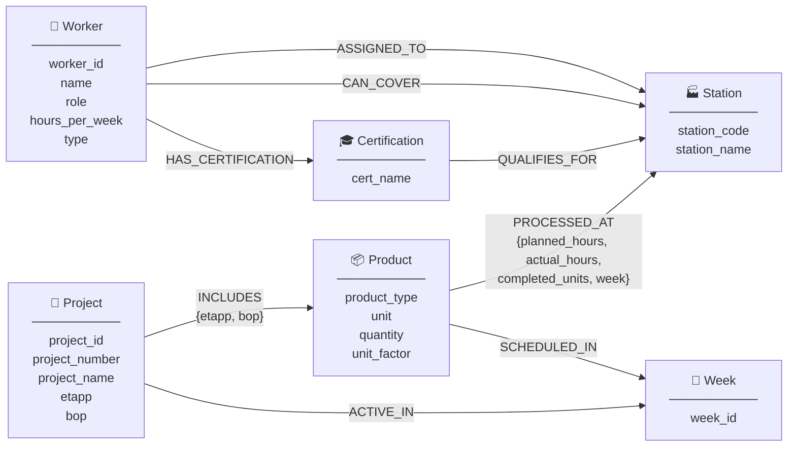

```mermaid
graph LR
    Project["📁 Project\n──────────\nproject_id\nproject_number\nproject_name\netapp\nbop"]
    Product["📦 Product\n──────────\nproduct_type\nunit\nquantity\nunit_factor"]
    Station["🏭 Station\n──────────\nstation_code\nstation_name"]
    Worker["👷 Worker\n──────────\nworker_id\nname\nrole\nhours_per_week\ntype"]
    Certification["🎓 Certification\n──────────\ncert_name"]
    Week["📅 Week\n──────────\nweek_id"]

    Project -->|"INCLUDES\n{etapp, bop}"| Product
    Product -->|"PROCESSED_AT\n{planned_hours, actual_hours,\ncompleted_units, week}"| Station
    Worker -->|ASSIGNED_TO| Station
    Worker -->|CAN_COVER| Station
    Worker -->|HAS_CERTIFICATION| Certification
    Certification -->|QUALIFIES_FOR| Station
    Project -->|ACTIVE_IN| Week
    Product -->|SCHEDULED_IN| Week
```
