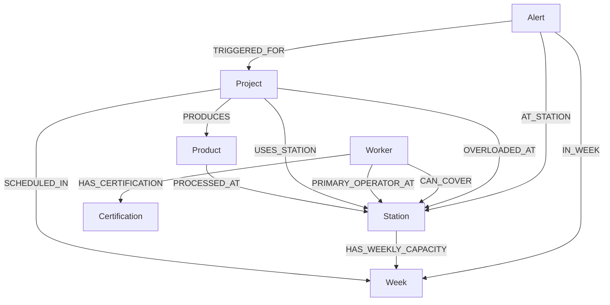

# Factory Knowledge Graph Schema



---

# Node Labels

| Node Label | Description | Source CSV |
|---|---|---|
| Project | Construction/manufacturing project | factory_production.csv |
| Product | Product type (IQB, SB, etc.) | factory_production.csv |
| Station | Production station/work area | factory_production.csv |
| Worker | Factory worker/operator | factory_workers.csv |
| Certification | Worker skills/certifications | factory_workers.csv |
| Week | Production week (w1–w8) | production + capacity CSV |
| Alert | Bottleneck/overload detection node | derived |

---

# Relationship Types

| Relationship | Meaning |
|---|---|
| PRODUCES | Project produces a product type |
| PROCESSED_AT | Product moves through a station |
| USES_STATION | Project requires a station |
| SCHEDULED_IN | Project active during a week |
| PRIMARY_OPERATOR_AT | Worker's main station |
| CAN_COVER | Worker can substitute at station |
| HAS_CERTIFICATION | Worker certifications |
| HAS_WEEKLY_CAPACITY | Station weekly production capacity |
| OVERLOADED_AT | Project exceeded planned hours |
| TRIGGERED_FOR | Alert linked to project |
| AT_STATION | Alert linked to station |
| IN_WEEK | Alert linked to week |

---

# Relationship Properties

## Example 1 — Project overload tracking

```text
(:Project)-[:OVERLOADED_AT {
    planned_hours: 35.0,
    actual_hours: 42.5,
    variance_percent: 21.4,
    week: "w4"
}]->(:Station)
```

---

## Example 2 — Worker station coverage

```text
(:Worker)-[:CAN_COVER {
    coverage_type: "backup",
    hours_per_week: 40
}]->(:Station)
```

---

## Example 3 — Weekly station capacity

```text
(:Station)-[:HAS_WEEKLY_CAPACITY {
    total_capacity: 480,
    total_planned: 612,
    deficit: -132,
    overtime_hours: 40
}]->(:Week)
```

---

# Design Rationale

The schema models factory operations as interconnected production, staffing, and capacity relationships. Projects produce products that flow through stations across weekly schedules, while workers and certifications represent staffing flexibility and operational dependencies.

Graph relationships capture production flow, worker substitution capability, and overload propagation between shared stations. Relationship properties store operational metrics such as planned hours, actual hours, weekly variance, and capacity deficits, enabling bottleneck analysis and workforce substitution queries.

This graph-based structure makes it easier to analyze cascading operational effects, recurring production bottlenecks, staffing risks, and historical production performance compared to traditional relational joins.